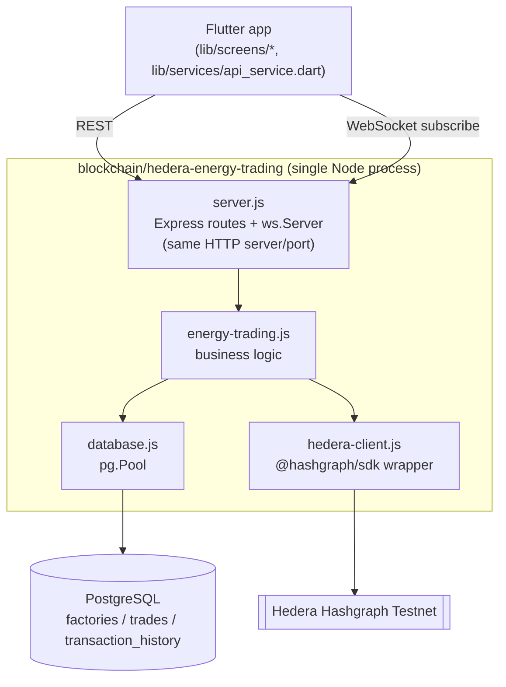
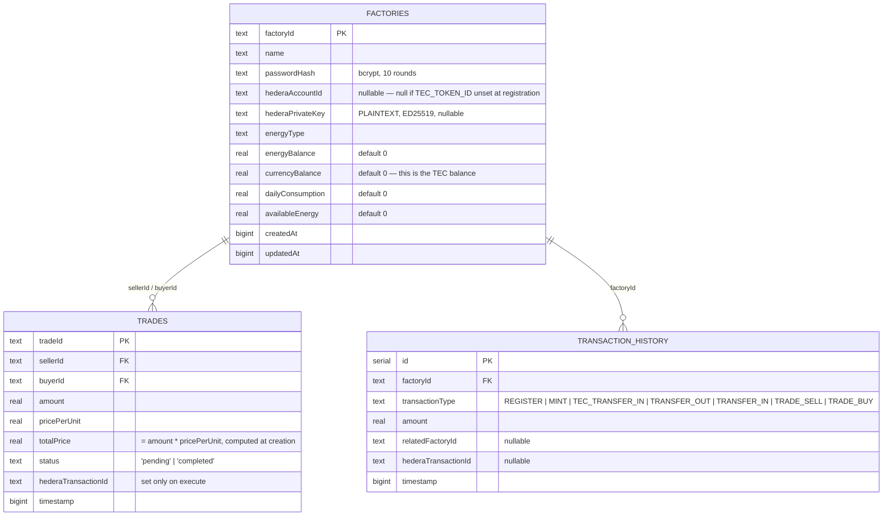

# EcoGuardians — Blockchain Energy Trading: Deep-Dive & Build Guide

> Scope: this document covers **only** `blockchain/hedera-energy-trading/` — the platform's real, working trading backend — plus how the Flutter app and (optionally) the rest of the repo relate to it. It is meant to be precise enough to build directly on top of: every mechanism described here is taken from the actual source (`server.js`, `energy-trading.js`, `hedera-client.js`, `init-token.js`, `database.js`, `schema.sql`), not from the README's aspirational description of the system. Where the code has a real limitation, it's called out explicitly and paired with a concrete way to close it — that's the part meant to be "built on."

---

## 0. Reading order

If you're about to extend this system, read in this order: §2 (architecture) → §3 (data model) → §4 (token economics) → §5 (identity/keys) → §6 (workflows) → §9 (gaps) → §10 (roadmap). Sections 7–8 are reference material to come back to.

---

## 1. Conceptual model, in one paragraph

A **factory** registers, gets its own real Hedera testnet account, and reports energy it produces. The backend **mints** TEC (Tunisian Energy Coin, a Hedera fungible token) 1:1 against that reported energy and credits the factory. Factories with surplus energy can be matched with factories in deficit through a **trade**: a `pending` record is created, then **executed** — at execution time, TEC actually moves from buyer to seller as a real Hedera token-transfer transaction, and the backend's own database is updated to reflect new energy/TEC balances on both sides. Everything except the token transfer itself (matching, validation, balance bookkeeping) happens in an ordinary Node.js server, not on-chain.

---

## 2. Architecture



**Layering, precisely:**
- `server.js` — every route handler is an inline async function; there is no router-splitting, no controller classes, no middleware-based auth.
- `energy-trading.js` — the single business-logic module. Every factory/trade operation lives here as a plain exported async function (`registerFactory`, `mintEnergyTokens`, `transferEnergy`, `createEnergyTrade`, `executeTrade`, `getFactory`, …). This is the file you'll touch for almost any new feature.
- `hedera-client.js` — the only place that talks to `@hashgraph/sdk` directly for account/token operations. `initializeHederaClient()` is called **fresh on every single Hedera operation** (it re-parses env vars and opens a new `Client.forTestnet()` each time, then `client.close()`s it in a `finally`) — there is no persistent/shared Hedera client instance.
- `database.js` — a single shared `pg.Pool`; `getDatabase()` just returns the pool (not a per-request connection). `dbRun`/`dbGet`/`dbAll` are thin wrappers around `pool.query()`.

---

## 3. Data model



Two important things to know before modifying this schema:

1. **`schema.sql` and `database.js`'s `initDatabase()` define the same three tables identically** (verified line-by-line) — good, they're in sync today. But **only `schema.sql` defines the five indexes** (`idx_trades_seller`, `idx_trades_buyer`, `idx_trades_status`, `idx_transaction_history_factory`, `idx_transaction_history_timestamp`). `initDatabase()` — the code path that actually runs every time the server boots — never creates them. **If you only ever run `npm start`, your database has no indexes on these tables**, no matter how much trade/history data accumulates. If you extend this schema, either add index creation to `initDatabase()` or make `schema.sql` the single source of truth and have the server run it directly.
2. **No migrations tool is used.** Both files are edited by hand in parallel. If you add a column, you must add it in both places (or, better, eliminate the duplication — see §10).

---

## 4. Token economics — TEC (Tunisian Energy Coin)

Created once, manually, via `npm run init` → `init-token.js`:

```js
new TokenCreateTransaction()
  .setTokenName("Tunisian Energy Coin")
  .setTokenSymbol("TEC")
  .setTokenType(TokenType.FungibleCommon)
  .setDecimals(2)
  .setInitialSupply(1000000)        // = 10,000.00 TEC, all in the treasury account
  .setTreasuryAccountId(treasuryId) // defaults to the operator account
  .setSupplyType(TokenSupplyType.Infinite)
  .setSupplyKey(operatorKey)        // operator can mint more, forever
  .setAdminKey(operatorKey)
```

**Consequences of this configuration, spelled out:**
- **Supply is uncapped** (`Infinite`) and grows every time any factory mints energy — the token has no fixed total supply; it's an inflationary model tied to cumulative reported energy production.
- **One single key (the operator/treasury key) can mint unlimited TEC.** There is no multi-sig, no threshold key, no DAO — whoever holds `MY_PRIVATE_KEY` fully controls issuance.
- **1 TEC = 1 unit of energy**, by convention enforced in application code, not by the token itself: `mintEnergyTokens(factoryId, amount)` mints `amount * 100` smallest-units of TEC (2 decimals ⇒ ×100) for every `amount` of energy a factory reports (`energy-trading.js:193`, comment at line 234: *"1:1 ratio - minting 1 kWh of energy also credits 1 TEC token"*). Nothing on the Hedera side enforces this ratio — it's purely a backend convention. If you change the mint amount formula, you change the token's backing without changing anything on-chain.
- **Every amount-to-token conversion floors via `Math.floor(amount * 100)`** (`energy-trading.js:22,109,193,479`) — fractional cents below 0.01 TEC are silently dropped, consistently in the same direction (systematic, not random, rounding loss).

---

## 5. Identity & key model

Two different key types are in play, and this distinction matters if you ever build tooling around these accounts:

| Account | Key type | Created by | Held where |
|---|---|---|---|
| Treasury/operator (`MY_ACCOUNT_ID`) | **ECDSA** — `PrivateKey.fromStringECDSA()` (`hedera-client.js:36`, comment: *"for accounts created in Hedera portal"*) | Manually, via portal.hedera.com | `.env` only |
| Each factory | **ED25519** — `PrivateKey.generateED25519()` (`hedera-client.js:68`) | Programmatically, at registration | Postgres `factories.hederaPrivateKey`, **plaintext** |

Registration flow for the Hedera side (`registerFactory`, only runs if `TEC_TOKEN_ID` is set):
1. `createFactoryAccount(10)` — new ED25519 keypair, `AccountCreateTransaction` funded with **10 HBAR** (hardcoded default).
2. `associateTokenWithAccount(...)` — required by Hedera before an account can receive a specific token; signed with the **factory's own new key**, not the treasury's.
3. If the caller supplied a non-zero `currencyBalance`, an initial TEC seed transfer from treasury to the new account, using the **treasury's key** (read fresh from `process.env.MY_PRIVATE_KEY` at call time, `energy-trading.js:100`).

**Known failure mode, already flagged as a TODO in the code itself** (`energy-trading.js:122-124`): if step 2 (association) fails after step 1 (account creation) succeeded, the new Hedera account is **orphaned with 10 HBAR** and no cleanup runs. Building a fix here (delete-and-reclaim, or a retry queue) is a good first PR.

**A second failure mode not yet flagged in the code:** if steps 1–3 all succeed but the subsequent `INSERT INTO factories` fails for any reason other than the already-checked "factory already exists" case, you get a fully-funded, token-associated Hedera account with **no corresponding database row at all** — worse than the documented TODO, because there's no `hederaAccountId` anywhere to even manually clean up later. If you touch `registerFactory`, consider inserting a placeholder DB row *before* the Hedera calls (status `provisioning`), then finalizing it after — a simple saga pattern.

---

## 6. Core workflows

### 6.1 Registration
```text
POST /api/factory/register  (server.js:163)
  → validate required fields, password ≥ 6 chars, numeric initialBalance
  → bcrypt.hash(password, 10)                         (server.js:189-191)
  → registerFactory(factoryData)                       (energy-trading.js:67)
      if TEC_TOKEN_ID set:
        → createFactoryAccount(10)                      [10 HBAR, new ED25519 key]
        → associateTokenWithAccount(...)                 [signed by factory key]
        → if currencyBalance > 0: transferTokensBetweenAccounts(treasury → factory)
      → INSERT INTO factories (...)
      → INSERT INTO transaction_history ('REGISTER', ...)
  ← { success, data: { factoryId, hederaAccountId, energyBalance, currencyBalance, ... } }
```

### 6.2 Minting (reporting produced energy)
```text
POST /api/energy/mint  (server.js:249)  body: { factoryId, amount }
  → mintEnergyTokens(factoryId, amount)                (energy-trading.js:163)
      if TEC_TOKEN_ID set:
        → validate TEC_TOKEN_ID matches /^0\.0\.\d+$/
        → mintTECTokens(TEC_TOKEN_ID, amount*100)        [signed by operator/supply key]
        → if factory has a Hedera account:
            transferTokensBetweenAccounts(treasury → factory, amount*100)
      → UPDATE factories SET energyBalance += amount, currencyBalance += amount
      → INSERT transaction_history('MINT', ...) [+ 'TEC_TRANSFER_IN' if transferred]
  ← { success, data: { previousBalance, newBalance, minted, hederaMintTransactionId, ... } }
```
Note: if `mintTECTokens` or the subsequent transfer throws, the **entire mint operation fails** (`energy-trading.js:227-230` explicitly re-throws) — the local DB is never updated on a partial Hedera failure here, which is the correct/safe ordering.

### 6.3 Trade creation → execution
```text
POST /api/trade/create  (server.js:305)  body: { tradeId, sellerId, buyerId, amount, pricePerUnit }
  → createEnergyTrade(...)                              (energy-trading.js:321)
      → validate seller/buyer exist, seller.energyBalance >= amount
      → totalPrice = amount * pricePerUnit
      → INSERT INTO trades (..., status='pending')
  → sendNotificationToFactory(buyerId, ...) over WebSocket (server.js:339)
  ← { success, data, notificationSent: true }

POST /api/trade/execute  (server.js:357)  body: { tradeId }
  → executeTrade(tradeId)                                (energy-trading.js:369)
      → reject if trade.status === 'completed'
      → if TEC_TOKEN_ID set: require both buyer AND seller to have hederaAccountId
      → require buyer.currencyBalance >= trade.totalPrice
      → transferTECOnHedera(buyer, seller, totalPrice)     [REAL on-chain transfer, buyer→seller]
      → (only after Hedera succeeds:)
          UPDATE seller/buyer energyBalance (seller -amount, buyer +amount)
          UPDATE buyer/seller currencyBalance (buyer -totalPrice, seller +totalPrice)
          UPDATE trades SET status='completed', hederaTransactionId=...
          INSERT transaction_history('TRADE_SELL'), INSERT transaction_history('TRADE_BUY')
  ← { success, data: { tradeId, status: 'completed', hederaTransactionId } }
```

**⚠️ Atomicity gap worth knowing before you build on this:** the Hedera transfer happens first (safe — if it fails, nothing in Postgres has changed yet), but the **seven subsequent Postgres statements are not wrapped in a SQL transaction** (no `BEGIN`/`COMMIT` anywhere in `energy-trading.js`). If the Node process crashes between any two of those seven `dbRun` calls, you end up with a **Hedera-confirmed token transfer whose local balances/history are only partially updated** — e.g. the trade could still show `pending` even though TEC has actually moved on-chain. There is currently no reconciliation job that cross-checks Hedera transaction receipts against Postgres state to detect or repair this. Wrapping these writes in a single Postgres transaction (`BEGIN; ...; COMMIT;`) is a small, concrete, high-value fix (see §10, Phase 1). The same gap exists in `registerFactory` and `mintEnergyTokens`.

### 6.4 Direct energy transfer (no token movement)
```text
POST /api/energy/transfer  (server.js:277)  body: { fromFactoryId, toFactoryId, amount }
  → transferEnergy(...)                                  (energy-trading.js:271)
      → purely local: UPDATE energyBalance -/+ amount on both factories
      → INSERT transaction_history('TRANSFER_OUT' / 'TRANSFER_IN')
```
This endpoint **never touches Hedera** despite living next to token-backed endpoints in the same API — worth renaming or documenting clearly if you build UI around it, so it isn't mistaken for a blockchain-settled operation.

---

## 7. API reference (trading-relevant subset)

| Method | Path | Body | Hedera call? | Notes |
|---|---|---|---|---|
| POST | `/api/factory/register` | factoryId, name, password, initialBalance, energyType, currencyBalance, dailyConsumption, availableEnergy | Yes, if `TEC_TOKEN_ID` set | Creates Hedera account |
| POST | `/api/factory/login` | factoryId, password | No | No token/session issued — see §9 |
| POST | `/api/energy/mint` | factoryId, amount | Yes, if `TEC_TOKEN_ID` set | |
| POST | `/api/energy/transfer` | fromFactoryId, toFactoryId, amount | **No** | Local-only, see §6.4 |
| POST | `/api/trade/create` | tradeId, sellerId, buyerId, amount, pricePerUnit | No | Also pushes a WS notification |
| POST | `/api/trade/execute` | tradeId | Yes, if `TEC_TOKEN_ID` set | |
| GET | `/api/factory/:id` \| `/balance` \| `/available-energy` \| `/energy-status` \| `/history` | — | No | Reads |
| PUT | `/api/factory/:id/available-energy` \| `/daily-consumption` | value | No | Manual input — see §9 |
| GET | `/api/factories` \| `/api/trade/:id` | — | No | |
| GET/DELETE | `/api/notifications/:factoryId` | — | No | In-memory, not persisted |

Full endpoint-by-endpoint detail (validation, response shape) is also in `TECHNICAL_DOCUMENTATION.md §9.1` if you need it.

---

## 8. Client integration status (Flutter)

What's real vs. mocked in `flutter_application_1`, so you know exactly what wiring work remains if you extend the UI:

| Screen | Real backend data | Mocked/static |
|---|---|---|
| `login_screen.dart` | Full register/login flow | — |
| `dashboard_screen.dart` | Factory list (`GET /api/factories`), trade create | Energy history chart is client-generated `sin()` + noise |
| `smart_contracts_screen.dart` | Trade create/execute/fetch | — |
| `profile_screen.dart` | `hederaAccountId`, `currencyBalance` via `GET /api/factory/:id` | Notification/auto-trading toggles, account stats, Export/Help buttons all no-ops |
| `blockchain_screen.dart` | Same two real fields as profile | Block height, "live transactions," validator stats — entirely fabricated, not backed by any endpoint |
| `my_factory_screen.dart` | Overview gauges from client-side `EnergyDataProvider` (itself a 5s randomized timer, not from this API) | Impact tab 100% static |

If you're building toward a real product, `blockchain_screen.dart` and the Impact tab are the two highest-value places to replace fabricated data — either with real Hedera Mirror Node queries (block height, recent transactions for the factory's account) or by removing the fabricated content.

---

## 9. Known gaps and risks (consolidated)

| Gap | Where | Why it matters if you build on this |
|---|---|---|
| No auth token/session issued after login | `energy-trading.js:651-702`, `server.js:221-242` | Every other endpoint is fully unauthenticated; anyone who knows/guesses a `factoryId` can mint, trade, or read history for it. **Fix before any real deployment.** |
| Plaintext private keys in Postgres | `schema.sql:9`, flagged in `database.js:5-9`'s own header | A DB read/leak = full custody loss for every factory account. Encrypt at rest or move to a KMS/HSM before this goes beyond a demo. |
| Multi-statement DB writes not wrapped in transactions | `registerFactory`, `mintEnergyTokens`, `executeTrade` in `energy-trading.js` | Crash-safety gap — see §6.3. |
| Missing indexes on fresh install | `database.js`'s `initDatabase()` vs `schema.sql` | See §3. |
| Orphaned Hedera accounts on partial registration failure | `energy-trading.js:122-124` (documented TODO) + the DB-insert-failure case (undocumented) | See §5. |
| `HederaConsensusService` (HCS) audit logging defined but never called | `createEnergyTradingTopic`/`logToHederaTopic`, `energy-trading.js:27-62` — no call site anywhere in the codebase | There is currently **no immutable on-chain record of trade terms**, only of token transfers. Wiring this up is one of the highest-value "build on it" opportunities (Phase 2 below). |
| No smart contract logic on Hedera | Entire trading flow | "Automated execution of agreements" happens in ordinary server code, not enforced by the ledger. See Phase 4 below if you want to change this. |
| `availableEnergy`/`dailyConsumption` are manually set via API | `PUT /api/factory/:id/available-energy` etc. | No live metering feeds this system — the Arduino/IoT code elsewhere in the repo is not connected. See Phase 3. |
| Single key controls unlimited TEC minting | `init-token.js` (`setSupplyKey(operatorKey)`) | No multi-sig/threshold protection on the treasury key. |
| `express.static(path.join(__dirname))` serves the whole project directory | `server.js:49` | `schema.sql`, `package-lock.json`, scripts are web-reachable. |
| CORS wide open, no rate limiting on this service | `server.js:44` | Present in `blockchain/files` and the Failure-detection gateway, but not here. |
| Self-healing login on NULL password hash | `energy-trading.js:664-674` | First login attempt with any password permanently claims a passwordless account. |
| Dead code: empty `finally {}` blocks throughout `energy-trading.js` | e.g. lines 154-156, 264-266, 314-316, 362-364, 448-450 | Harmless leftover from a pre-pool refactor (`closeDatabase` is no longer meaningfully called) — safe to remove, not a functional bug. |

---

## 10. Build roadmap — concrete phases

### Phase 1 — Harden the existing MVP (no new features, closes real risk)
1. Wrap the multi-statement writes in `registerFactory`/`mintEnergyTokens`/`executeTrade` in Postgres transactions (`BEGIN`/`COMMIT`/`ROLLBACK`).
2. Add index creation to `initDatabase()` (or run `schema.sql` directly on boot instead of maintaining two copies).
3. Issue a session token (JWT is the path of least resistance) from `POST /api/factory/login`, and add an auth-check middleware to every mutating/read-sensitive route.
4. Encrypt `hederaPrivateKey` at rest (envelope encryption with a key from an env-provided master key, at minimum, as a stepping stone to a real KMS).
5. Replace the real-looking credentials in `.env.example` with obvious placeholders; rotate the key if it was ever live.
6. Reconcile the `DB_PORT` default (5432 vs 5433) between `.env.example`/README and the code's actual fallback.
7. Add rate limiting (`express-rate-limit`, already a dependency pattern used elsewhere in the repo) to this service.

### Phase 2 — Real on-chain audit trail (uses code that already exists, unused)
`createEnergyTradingTopic()` and `logToHederaTopic()` are fully implemented and just need to be called:
1. Create one HCS topic at deploy time (or on first boot if `TRADE_TOPIC_ID` is unset), store its ID in `.env`.
2. On `createEnergyTrade` and `executeTrade`, call `logToHederaTopic(topicId, {tradeId, sellerId, buyerId, amount, pricePerUnit, status, timestamp})`.
3. This gives you an **immutable, independently-verifiable log of trade terms** (not just settlements) — the piece the current system is missing to back up its "audit trail" claims.

### Phase 3 — Real energy metering
Currently `availableEnergy`/`dailyConsumption` are set via a manual `PUT` call. To make this data-driven:
1. Build a small adapter (a new, thin service, or an extension of the existing IoT rig in `other-interfaces/Arduino-code+interfaces/`) that periodically reads real/simulated meter data and calls `PUT /api/factory/:id/available-energy` and `/daily-consumption`.
2. Longer-term, consider having that adapter call `POST /api/energy/mint` directly when it detects net-positive production over an interval, replacing the manual mint trigger.

### Phase 4 — Smart-contract-backed trade execution
To make "automated execution of agreements" a ledger-level guarantee rather than an application-level one:
1. Move trade escrow/execution into a Hedera Smart Contract (via HSCS) that holds buyer TEC in escrow on `createEnergyTrade` and releases it atomically to the seller on `executeTrade`, only when preconditions (seller energy balance, buyer TEC balance) are verified on-chain.
2. This removes the current "trust the backend" assumption for trade settlement — today, a compromised or buggy backend can mark trades `completed` and move TEC without any on-chain enforcement of the underlying conditions beyond the raw token transfer itself.
3. This is a substantial change (Hedera Smart Contract Service, likely Solidity + the JSON-RPC relay or HSCS-specific tooling) — treat it as its own project phase, not a small PR.

### Phase 5 — Reduce central coordination
Today, one Node.js process and one Postgres database decide every match and every balance. If genuine decentralization matters for this project's goals:
1. Consider whether trade *matching* (not just settlement) could move on-chain or into a more auditable, replicated mechanism.
2. Consider multiple independent read-replicas/observers of the HCS topic log (from Phase 2) as a way to let any party verify the system's state without trusting the single backend's database.

---

## 11. Quick-win checklist (do these first, in a single focused PR)

- [ ] Wrap `executeTrade`'s DB writes in a transaction
- [ ] Add index creation to `initDatabase()`
- [ ] Fix `.env.example`'s committed-looking credentials
- [ ] Reconcile `DB_PORT` default across `.env.example`, README, and code
- [ ] Add a basic auth token to `/api/factory/login` and gate at least the mutating endpoints
- [ ] Wire up `logToHederaTopic` on trade create/execute (Phase 2 — small, high-value, code already exists)

---

## 12. File map (this subsystem only)

| File | Role |
|---|---|
| `server.js` | Express routes, WebSocket server, startup |
| `energy-trading.js` | All business logic — start here for any new feature |
| `hedera-client.js` | Low-level Hedera SDK calls |
| `database.js` | `pg.Pool`, table creation, query helpers |
| `init-token.js` | One-off: creates the TEC token (`npm run init`) |
| `schema.sql` | Canonical schema **including indexes** — not auto-run by the server |
| `clean-database.js` | Manual: deletes `transaction_history` rows only (despite its comment claiming "all tables") |
| `fix-password-hashes.js` | Manual: remediates NULL `passwordHash` rows |
| `view-database.js` | Manual: read-only inspection/reporting |
| `docker-compose.yml` | PostgreSQL container only — no app container |
| `.env.example` | Template — contains a real-looking credential today, see §9 |
