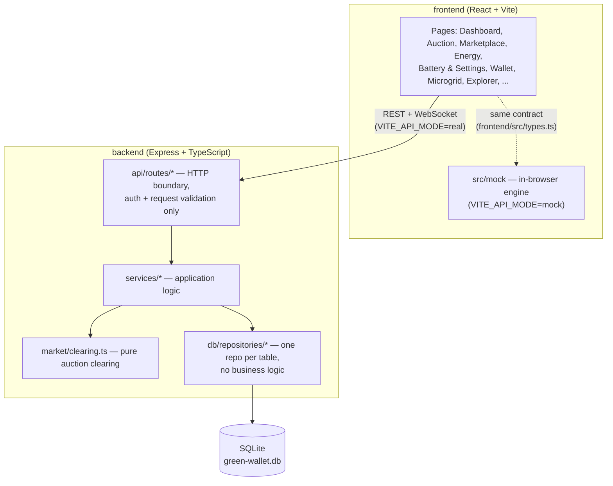
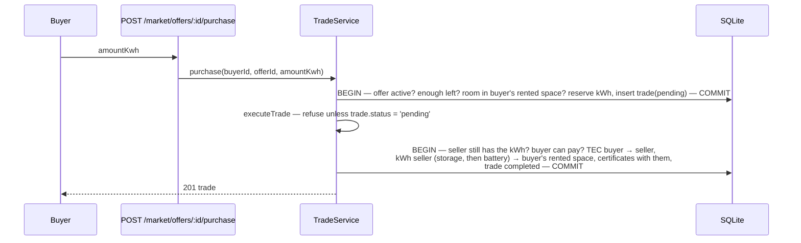

# Architecture

How the code implements [DESIGN.md](DESIGN.md). The design says *what* the market does;
this page says *where* it happens.

## Layers



`frontend/src/types.ts` is the API contract: the backend returns exactly those shapes, and
the in-browser mock implements the same contract so the frontend runs without a backend.

### Services

| Service | Owns |
|---|---|
| `ClockService` | simulated time and the interval counter (persisted in `meta`) |
| `MarketService` | the market clock: closes every interval (decay → auction → clock → offer expiry) |
| `AuctionService` | automatic bids, TEC reservation, settlement through the clearing account, imbalance |
| `MeasurementService` | meter readings: certificates, self-use, own battery / storage, what waits for the auction |
| `GridService` | the shared battery (rented space + grid pool), storage decay, listable kWh, the energy check |
| `CertificateService` | which certificates travel with a given amount of energy; green share |
| `LedgerService` | every TEC and certificate movement, Hedera-style IDs, simulated fees, hash-chained blocks |
| `MarketplaceService` / `TradeService` | fixed-price offers and their atomic settlement |
| `HouseholdService` / `AuthService` | the contract's household view, agent settings, registration rules |
| `TokenService` | wallet, top-up / cash-out, history |
| `AnalyticsService` | dashboard (with the five conservation checks) and the microgrid map |
| `SimulationService` | one simulated reading per household at the start of every interval |

## Physical vs. digital layer

| Layer | Owns | Lives in |
|---|---|---|
| Physical energy | kWh in batteries, rented storage, the grid pool, readings and their flow | `households`, `grid_storage`, `energy_measurements` |
| Proof of origin | SOLAR / WIND certificates (account balances that follow the kWh) | `accounts.solarBalance / windBalance`, `ledger_transactions` |
| Money | TEC balances, reservations, the treasury / clearing / grid-storage accounts | `accounts.balance / reservedBalance`, `ledger_transactions` |
| Off-ledger | the utility statement (imports and exports, real money) | `households.imported* / exported*` |

Production never creates money: it issues certificates. TEC only moves when energy
changes hands (auction, marketplace) or through the treasury (grants, top-ups, cash-outs).

## One market interval

```mermaid
sequenceDiagram
    participant Clock as MarketService (timer)
    participant Grid as GridService
    participant Auction as AuctionService
    participant Ledger as LedgerService
    participant Sim as SimulationService
    participant Meter as MeasurementService

    Note over Meter: during the interval: readings use own battery and storage at once;<br/>leftover surplus / deficit wait (pendingSellKwh / pendingBuyKwh), buyer TEC reserved
    Clock->>Grid: applyDecay() — stored kWh decay into the grid pool
    Clock->>Auction: settle()
    Auction->>Auction: build bids (households + grid pool), clearAuction()
    Auction->>Ledger: buyers → clearing, sellers' certificates → clearing, clearing → sellers
    Auction->>Ledger: certificates clearing → buyers (retired as consumed), residue → treasury
    Auction->>Auction: unmatched supply exported, unmatched demand imported
    Auction->>Ledger: AUCTION_SUMMARY record
    Clock->>Clock: advance clock, expire offers (all of the above: one DB transaction)
    Clock->>Sim: interval started
    Sim->>Meter: one reading per household
```

The market clock runs whether or not the simulation is on, so manual readings settle too.
Clearing is a pure function (`market/clearing.ts`) so it can be tested on its own.

## Marketplace purchase (the "smart contract")



Settlement is a single transaction: if any check fails, nothing moves and the reserved
kWh go back to the offer. Reserving before executing stops two buyers from taking the same
kWh; the `pending` check stops a trade from settling twice.

## Ledger

Every TEC and certificate movement goes through `LedgerService`: it checks balances,
updates them atomically, gives the transaction a Hedera-style ID
(`0.0.1000@<seconds>.<seq>`) and a simulated fee paid by the operator, and seals it into a
hash-chained block. Operator accounts: `0.0.1000` operator (fee payer), `0.0.1001`
treasury, `0.0.1002` clearing, `0.0.1003` grid storage, `0.0.1004` main utility grid
(receives the certificates of exported energy).

The app runs in local mode only. The `BlockchainService` interface and the original
`HederaBlockchainService` adapter are kept for a future real-Hedera deployment, but they
are not wired to the new money model; if `HEDERA_*` variables are set, the server warns and
ignores them.

## Conservation checks

`AnalyticsService.checks()` (shown on the dashboard, asserted in the tests):

| Check | Holds when |
|---|---|
| Money | Σ account balances = TEC created − TEC destroyed |
| Clearing | the clearing account is back to 0 after every auction |
| Energy | initial stock + produced + imported = consumed + exported + everything stored or waiting |
| Certificates | issued = held + retired |
| No negatives | no balance, stock or certificate balance below 0 |

## Simulation

`SimulationService` records one reading per household at the start of every market
interval (default: 30 simulated minutes every 5 real seconds, a day in ~4 minutes). Each
role has its own profile (`simulation/curves.ts`): a large solar curve, a steadier wind
curve, rooftop solar for prosumers, and household loads with morning and evening peaks.
Every reading goes through the same `MeasurementService.record()` path as a manual
`POST /api/energy/measurements`.
