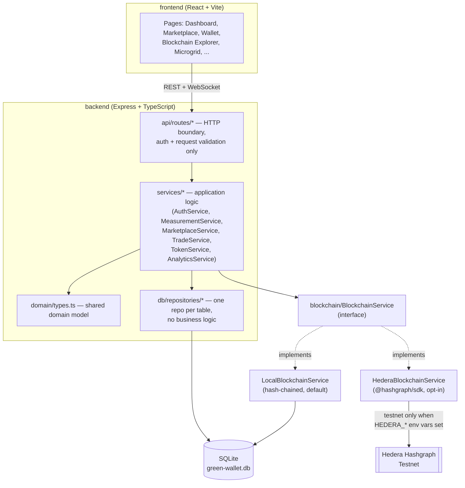
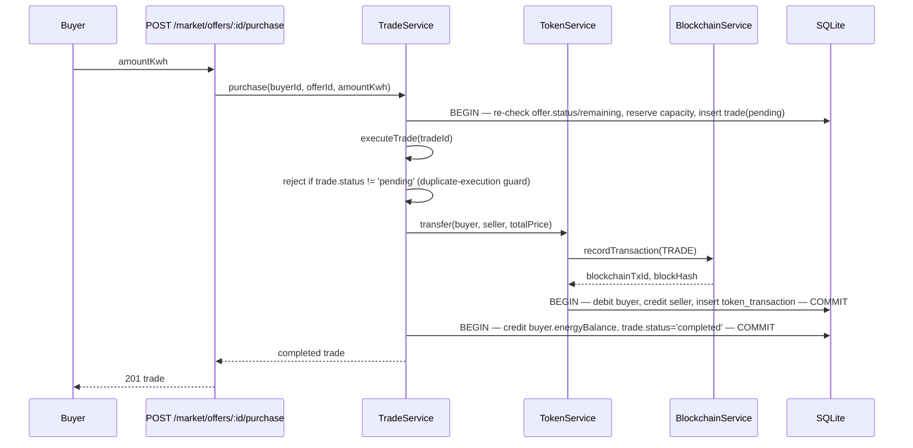
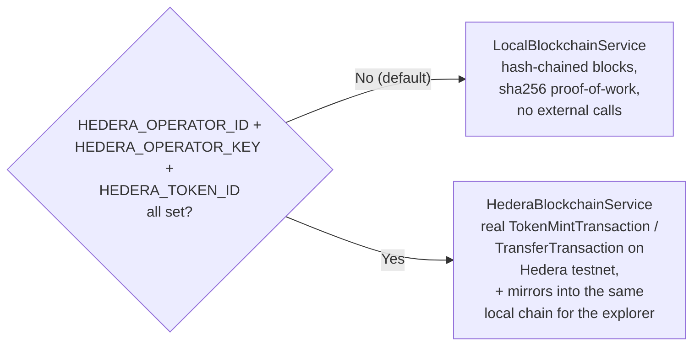

# Architecture

## Layers

**Why this shape:** the functional spec explicitly asks for a `BlockchainService`-style
abstraction so the ledger implementation can be swapped without touching the rest of the
app. `TokenService` and `TradeService` depend only on the `BlockchainService` interface
(`recordTransaction`, `provisionAccount`, `getChain`, `getStatus`) — swapping
`LocalBlockchainService` for `HederaBlockchainService`, or a future
Ethereum/Polygon/Hyperledger implementation, requires no change outside
`blockchain/index.ts`.

## Physical vs. digital layer

The spec requires these to be kept conceptually separate — concretely:

| Layer | Owns | Lives in |
|---|---|---|
| Physical energy | kWh readings, surplus/deficit math | `MeasurementService`, `energy_measurements` table |
| Digital/trading | TEC token balances, transfers, ledger records | `TokenService`, `BlockchainService`, `token_transactions` / `blockchain_transactions` tables |

`MeasurementService` never touches token balances directly — it calls
`TokenService.mint()` when a positive surplus is recorded. `TradeService` never touches
kWh accounting beyond what `MarketplaceService`/`HouseholdRepository` already track — it
calls `TokenService.transfer()` for the financial settlement. This mirrors domain rule
#11 in the spec (token/financial value stays conceptually separate from physical
electricity).

## Trade execution (the "smart contract")

Every multi-statement write is wrapped in a single `better-sqlite3` `db.transaction()`
call (synchronous, atomic) — this closes the non-atomic-writes gap called out in the
reference architecture doc this project builds on. The offer's remaining capacity is
reserved *before* the async token transfer runs, and re-validated inside the same
transaction, so two concurrent purchases against the same offer cannot both succeed
(double-spend on energy). `executeTrade` refuses to run twice against a trade that isn't
`pending` (double-spend on tokens / duplicate settlement).

## Blockchain: local vs. Hedera mode

Nothing about the app's business logic changes between modes — only which
`BlockchainService` implementation `blockchain/index.ts` constructs at boot. This is a
deliberate consequence of the functional spec's requirement that a simplified ledger be
acceptable for the MVP as long as it's structured to be replaced later.

## Simulation

`SimulationService` runs a fast internal clock (default: +30 simulated minutes every 5
real seconds, so a full day cycles in ~4 minutes) and drives a per-household solar
production curve (zero at night, peaking at midday) and an independent consumption curve
(morning/evening peaks) — see `simulation/curves.ts`. Every tick calls the same
`MeasurementService.record()` path a manual `POST /api/energy/measurements` would.
