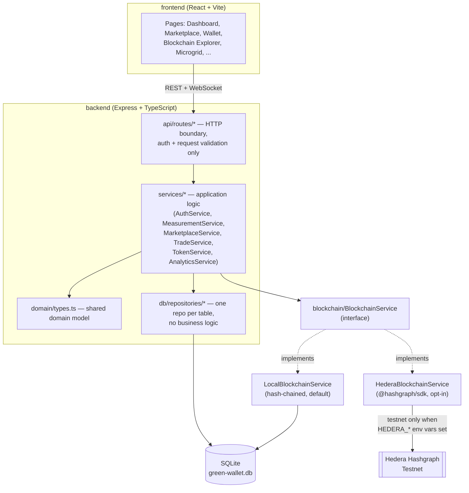
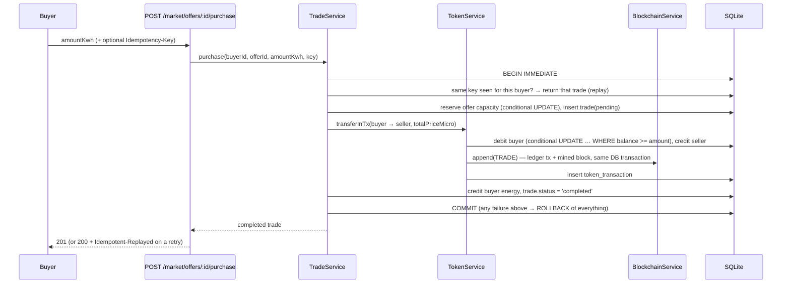
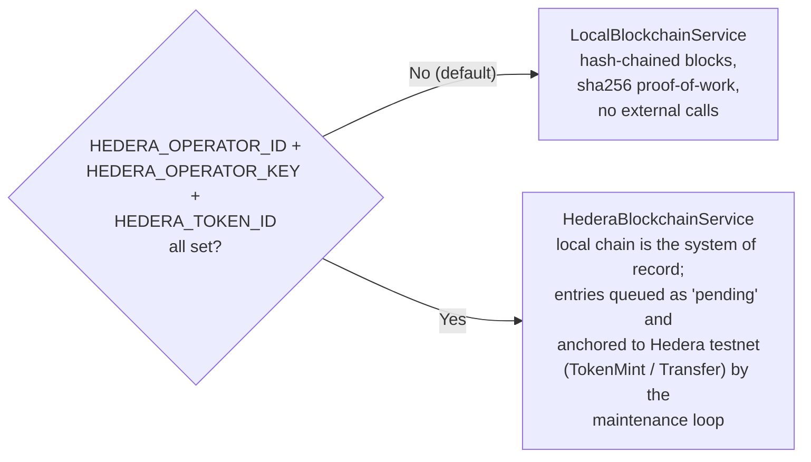

# Architecture

## Layers

**Why this shape:** the functional spec explicitly asks for a `BlockchainService`-style
abstraction so the ledger implementation can be swapped without touching the rest of the
app. `TokenService` and `TradeService` depend only on the `BlockchainService` interface
(`append`, `anchorPending`, `provisionAccount`, `getChain`, `getStatus`, `verifyChain`) — swapping
`LocalBlockchainService` for `HederaBlockchainService`, or a future
Ethereum/Polygon/Hyperledger implementation, requires no change outside
`blockchain/index.ts`.

## Physical vs. digital layer

The spec requires these to be kept conceptually separate — concretely:

| Layer | Owns | Lives in |
|---|---|---|
| Physical energy | kWh readings, surplus/deficit math | `MeasurementService`, `energy_measurements` table |
| Digital/trading | TEC token balances, transfers, ledger records | `TokenService`, `BlockchainService`, `token_transactions` / `blockchain_transactions` tables |

`MeasurementService` never touches token balances directly — it calls
`TokenService.issueInTx("MINT", …)` when a positive surplus is recorded. `TradeService` never touches
kWh accounting beyond what `MarketplaceService`/`HouseholdRepository` already track — it
calls `TokenService.transferInTx()` for the financial settlement. This mirrors domain rule
#11 in the spec (token/financial value stays conceptually separate from physical
electricity).

## Money and energy units

All amounts are **integers** in storage and arithmetic (`domain/units.ts`): energy in
Wh, TEC in µTEC (10⁻⁶), prices in µTEC per kWh. Decimal kWh/TEC exist only at the API
boundary (repositories convert when mapping rows). Trade totals are computed with
BigInt and rounded half-up to the µTEC; a purchase whose total rounds to 0 is rejected.
The schema enforces the invariants itself: `CHECK (typeof(x) = 'integer' AND x >= 0)` on
every balance, so no code path — or bug — can store a negative or fractional balance.

## Trade execution (the "smart contract")

**One transaction per money movement.** A purchase, a mint (with its meter reading), a
grant (with its household) and a transfer each commit their balance changes, their
`token_transactions` record and their ledger block together — or not at all. There is no
`await` inside a transaction, so nothing can interleave between a balance check and the
debit; the check *is* the debit (`UPDATE … WHERE balance >= amount`). `BEGIN IMMEDIATE`
takes the write lock up front, so this also holds across processes sharing the file.

The two-phase API (`createTrade` → `executeTrade`) still exists for callers that need to
reserve first. `executeTrade` refuses to settle a trade that isn't `pending`, and the
ledger maintenance loop releases trades left `pending` longer than
`PENDING_TRADE_TIMEOUT_MS` (capacity goes back to the offer, or to the seller if the
offer was cancelled meanwhile).

## Ledger integrity

- **Content-committing blocks.** A block hash (v2) covers a digest of each transaction's
  contents (id, type, parties, amount, timestamp, payload), so editing any recorded
  amount breaks the chain. Blocks written before this change keep their legacy v1
  (ids-only) hash and are reported as `legacyBlocks`.
- **Verification.** `GET /api/blockchain/verify` recomputes every hash and chain link.
- **Reconciliation.** `LedgerMaintenanceService.reconcile()` checks that every balance
  equals the sum of its token history, that every token transaction matches its ledger
  record, and that total balances equal total issuance (GRANT + MINT). Both checks run at
  boot and via `npm run ledger:check` (exit code 1 on any problem).
- **Migrations.** `db/migrations.ts` holds ordered, append-only migrations recorded in
  `schema_migrations`; a migration that finds data violating an invariant fails and
  rolls back rather than "fixing" it.

## Blockchain: local vs. Hedera mode

In Hedera mode the local ledger is still written synchronously inside the settlement
transaction; each entry is queued with `anchorStatus = 'pending'` (an outbox), and the
maintenance loop (`LEDGER_MAINTENANCE_INTERVAL_MS`) replays the queue onto Hedera in
ledger order. A Hedera outage delays anchoring but never fails or half-applies a trade.
Failed attempts are retried; after `LEDGER_ANCHOR_MAX_ATTEMPTS` an entry is marked
`failed` for operator follow-up (counts appear in `/api/blockchain/status`).

Nothing about the app's business logic changes between modes — only which
`BlockchainService` implementation `blockchain/index.ts` constructs at boot. This is a
deliberate consequence of the functional spec's requirement that a simplified ledger be
acceptable for the MVP as long as it's structured to be replaced later.

## Simulation

`SimulationService` runs a fast internal clock (default: +30 simulated minutes every 5
real seconds, so a full day cycles in ~4 minutes) and drives a per-household solar
production curve (zero at night, peaking at midday) and an independent consumption curve
(morning/evening peaks) — see `simulation/curves.ts`. Every tick calls the same
`MeasurementService.record()` path a manual `POST /api/energy/measurements` would.
