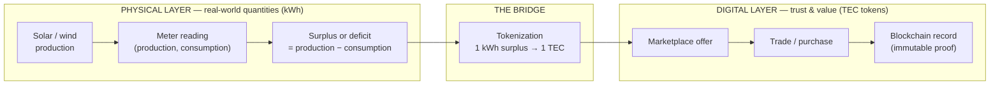
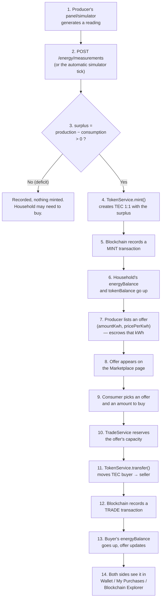
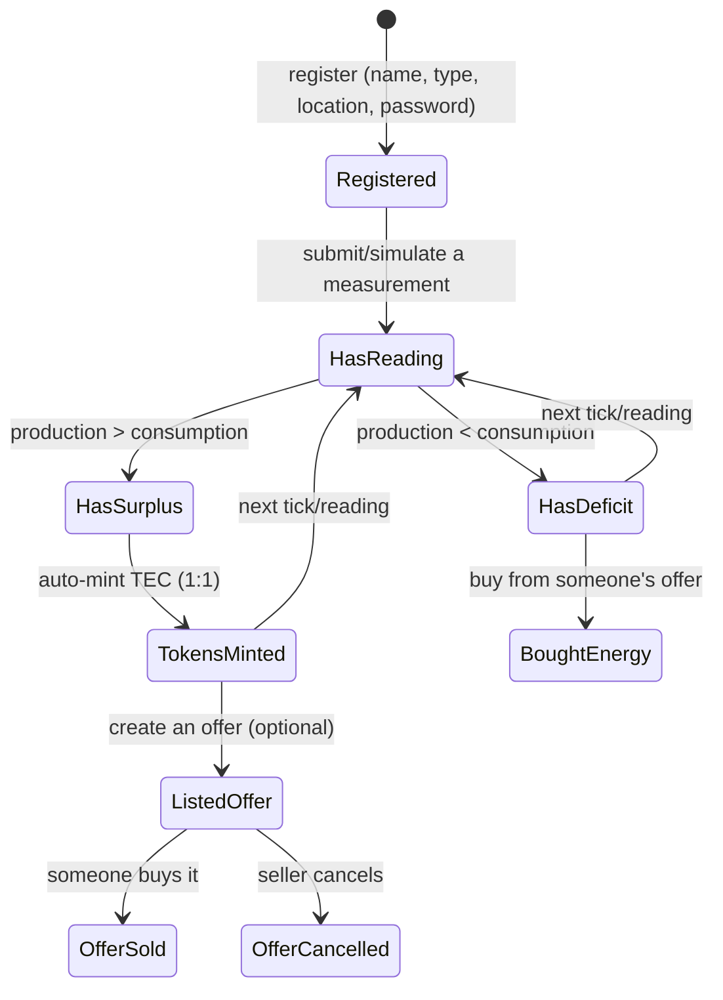
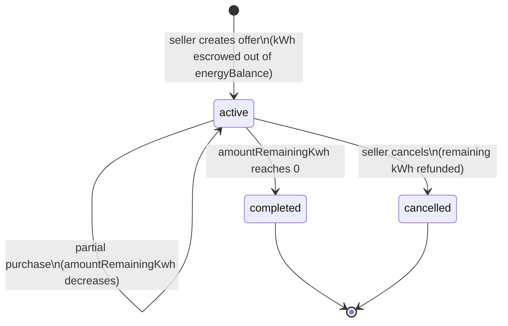
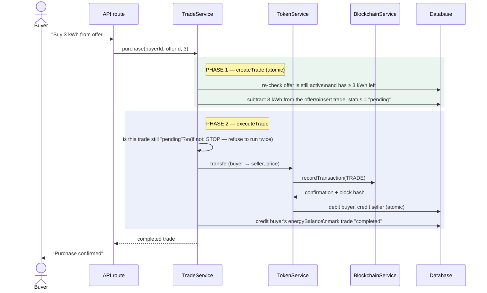
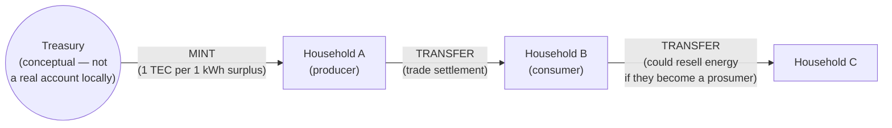
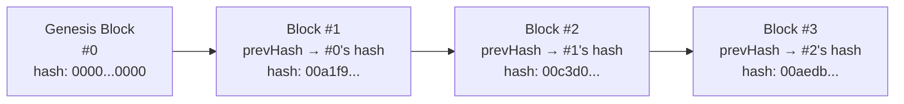
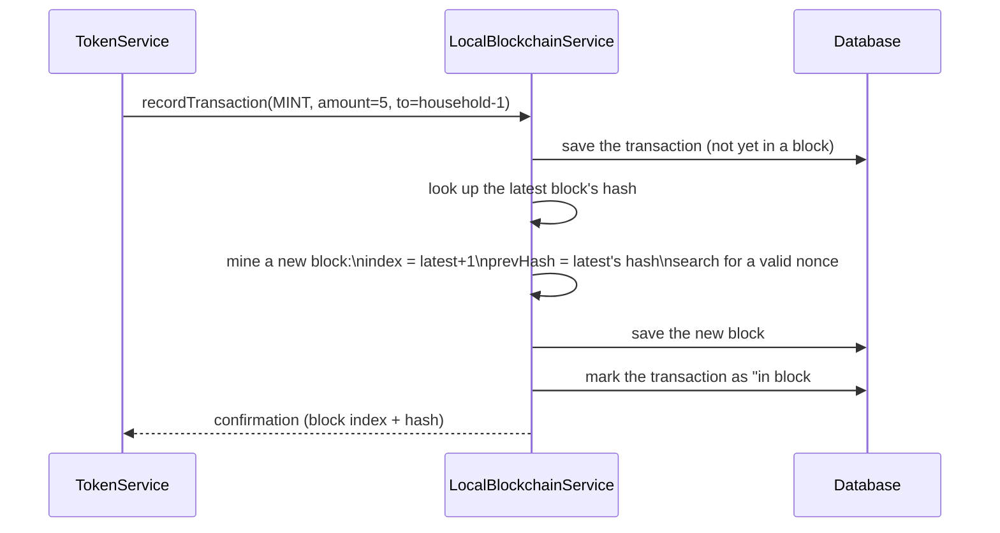
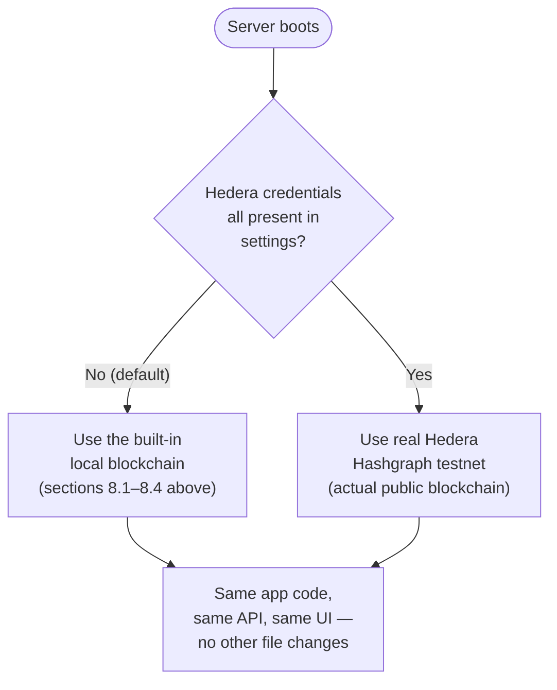
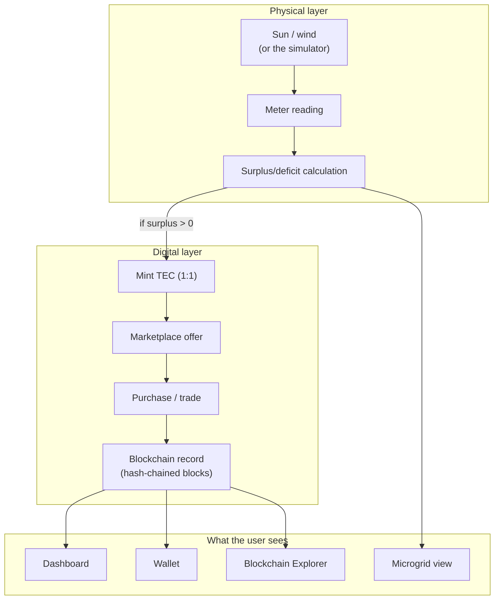

# The Pipeline — How Data Moves, and How the Blockchain Works

This document explains the *concept* behind the project: the journey a single unit of
electricity takes from a solar panel to a neighbor's wallet, and the mechanics of the
blockchain that records it. It's diagram-heavy on purpose — read the diagrams first,
the text fills in the "why."

---

## 1. The big picture

The whole system is really just two pipelines glued together at one point: a **physical
pipeline** (energy) and a **digital pipeline** (money/trust). They only touch at the
moment a surplus gets tokenized, and again at the moment a trade settles.



**Rule of the whole project:** the blockchain never moves electricity. It only moves
and records *tokens*. A wire, a meter, and this app's own bookkeeping are what "move"
energy conceptually (by updating balances) — the blockchain's job is strictly to make
the token side of that story tamper-evident and auditable.

---

## 2. Physical layer vs. digital layer, side by side

| | Physical layer | Digital layer |
|---|---|---|
| Unit | kWh (kilowatt-hours) | TEC (a token, 1 TEC ≈ 1 kWh of tokenized surplus) |
| What it represents | Real (or simulated) electricity produced/used | Ownership / trading value |
| Where it lives | `energy_measurements`, `households.currentProduction/currentConsumption/energyBalance` | `token_transactions`, `households.tokenBalance`, the blockchain tables |
| Who changes it | `MeasurementService` (readings), `MarketplaceService` (escrow) | `TokenService`, `BlockchainService` |
| Can it be faked by a user? | No — server always recalculates, never trusts client-sent balances | No — same rule, all writes happen server-side inside atomic transactions |
| Analogy | The electricity actually flowing through the wires | The receipt proving who paid whom for it |

---

## 3. The end-to-end journey of one kWh

This is the full pipeline, start to finish, for a single successful trade.



Fourteen steps, but only three "owners":

| Steps | Owned by | In plain words |
|---|---|---|
| 1–6 | Physical → tokenization | "I made extra power, so I earned coins for it." |
| 7–10 | Marketplace | "I'm selling some of those coins'-worth of power; you want to buy some." |
| 11–14 | Settlement + ledger | "The coins actually moved, and it's permanently written down." |

---

## 4. Household state — what a household looks like over time



A household is never "only a producer" or "only a consumer" in the data model — those
are just labels. What actually matters every tick is the *sign* of
`production − consumption`. A "prosumer" is simply a household that sometimes has
surplus and sometimes has deficit.

---

## 5. The marketplace offer lifecycle



The escrow trick matters: the moment an offer is created, that kWh is subtracted from
the seller's sellable balance immediately — not just "reserved on paper." That's what
makes it impossible to list the same surplus in two different offers at once.

---

## 6. Trade execution — the closest thing this project has to a "smart contract"

A trade happens in two internal phases, even though the user only sees one "Buy"
button. This two-phase design is what makes the whole thing safe against cheating and
against timing accidents (two people clicking "Buy" on the same offer at the same
instant).



### Why two phases, and why it matters

| Danger | How it's stopped |
|---|---|
| Two buyers grab the last kWh of the same offer at the same time | Phase 1 re-checks the *live* remaining amount right before subtracting, inside one atomic database transaction — the second buyer's check will correctly fail. |
| The same trade gets "executed" twice (e.g. a network retry) | Phase 2 refuses to run unless the trade's status is still `pending`. Once it flips to `completed`, running it again is rejected outright. |
| The buyer's coin balance changes between "add to cart" and "checkout" | The coin balance is checked fresh, at the moment of transfer, not from a stale number shown earlier on the screen. |
| Server crashes mid-trade | Every multi-step database write happens inside one atomic `transaction()` block — either *all* the steps happen, or *none* do. There's no "half-finished" trade left behind. |

This is called the "smart contract" of the project because it behaves the way a
blockchain smart contract would (checks conditions, then executes irreversibly, with no
partial states) — but it's important to be honest that it's ordinary server code
enforcing these rules, not code running immutably on a blockchain. Section 8 explains
exactly where the line is.

---

## 7. Token economics — how TEC is created and destroyed (spoiler: it isn't destroyed)



- **TEC only enters the system through minting** — and minting only happens when a
  positive surplus is recorded. There's no way to create TEC out of thin air through
  the marketplace.
- **TEC never leaves the system** — a trade just moves it from one household to
  another. Total TEC in circulation only ever goes up (visible on the Dashboard as
  "TEC in circulation").
- **kWh and TEC are tracked completely separately**, on purpose (see the table in
  section 2). A household's `energyBalance` (kWh they can still sell) and
  `tokenBalance` (TEC they can still spend) are two different numbers that just happen
  to start out equal, because minting is 1:1.

---

## 8. How the blockchain actually works

### 8.1 What a "block" is, concretely

Every block in this project's local blockchain is a small record with exactly these
fields:

| Field | Example | What it means |
|---|---|---|
| `index` | `42` | Its position in the chain — block 42 comes after block 41. |
| `timestamp` | `1790018447963` | The moment it was mined. |
| `previousHash` | `00c3d06c32ca...` | The fingerprint of the block right before it. |
| `hash` | `00aedb7c4b64...` | This block's own fingerprint. |
| `nonce` | `158` | A number that was searched for to make the hash "valid" (see 8.3). |
| `transactionIds` | `["tx-91a3..."]` | Which transaction(s) this block contains. In this project, it's always exactly one — one block is mined per transaction, so cause and effect are easy to follow in the explorer. |

### 8.2 Chaining — why you can't quietly edit old history



Each block stores the *fingerprint* (hash) of the block before it. The fingerprint is
computed from *everything* in the block — its index, its timestamp, its transactions,
its nonce. Change **one character** of a past transaction, and that block's own hash
changes completely, which no longer matches what the *next* block says its
`previousHash` should be. The mismatch is immediately detectable — that's what "tamper
evident" means, and it's the entire point of a blockchain.

The app has an automated test that proves this directly: it takes a real block,
changes one field, and confirms the hash-check correctly says "invalid."

### 8.3 The "fingerprint" (hashing) and mining, in plain words

A **hash** is a scrambling function: feed it any text, and it spits out a fixed-length
string of letters/numbers that looks completely random. Two important properties:

1. The *same* input always produces the *same* hash.
2. Changing *anything* in the input — even one letter — produces a *completely
   different* hash (not a "slightly different" one).

```
sha256("block #1, time 1790018447963, prevHash 0000...") → "7f3ac9e1b2d0..."
sha256("block #1, time 1790018447964, prevHash 0000...") → "2b91fca0d817..."
                     ^ one digit changed here                ^ totally different result
```

"**Mining**" a block just means: try different `nonce` numbers until the resulting hash
happens to start with a couple of zeros (`00...`). This is called "proof of work" — it
proves *some* amount of computer effort was spent, which is the classic blockchain
trick for making history expensive to rewrite. This project uses a very easy difficulty
(so it mines instantly, useful for a demo) — a real public blockchain uses a much
harder target, which is why real mining takes real electricity and real time.

### 8.4 One transaction, one block



### 8.5 Two possible "backends" for the same interface

The rest of the app never talks to the blockchain directly — it only talks to one
shared interface (`recordTransaction`, `getChain`, `getStatus`). Which real
implementation answers those calls depends on configuration, decided once when the
server starts:



| | Local (default) | Real Hedera testnet (opt-in) |
|---|---|---|
| Needs an internet connection? | No | Yes |
| Needs a real crypto account? | No | Yes — you create your own free one |
| Is it publicly verifiable by others? | No — only lives in this app's own database | Yes — a real, independent public network |
| Speed | Instant | A few real seconds per transaction |
| What changes in the app to switch? | Nothing — one setting decides which is used | Nothing — one setting decides which is used |

---

## 9. A full worked example, with real numbers

| Step | Event | producer-1's numbers | consumer-1's numbers |
|---|---|---|---|
| 0 | Start | production 0, energyBalance 0, TEC 0 | production 0, TEC 50 (seeded) |
| 1 | Reading: produced 8 kWh, used 3 kWh | surplus = 5 kWh | — |
| 2 | Auto-mint (5 kWh → 5 TEC) | energyBalance 5, TEC 5 | — |
| 3 | Lists offer: 3 kWh @ 0.20 TEC/kWh | energyBalance 2 (3 escrowed) | — |
| 4 | consumer-1 buys 3 kWh (cost = 3 × 0.20 = 0.60 TEC) | — | — |
| 5 | Trade settles | TEC 5 + 0.60 = **5.60** | TEC 50 − 0.60 = **49.40**, energyBalance +3 |
| 6 | Recorded on the blockchain | a MINT block (step 2) + a TRADE block (step 5) now exist, both visible in the Blockchain Explorer | same |

---

## 10. Where everything is stored (data map)

| Table | What it holds | Written by |
|---|---|---|
| `households` | Identity, current readings, kWh balance, TEC balance | `HouseholdRepository`, updated by almost every service |
| `energy_measurements` | Every reading ever submitted (timestamped) | `MeasurementService` |
| `energy_offers` | Marketplace listings and their remaining amount/status | `MarketplaceService`, `TradeService` |
| `energy_trades` | Every purchase attempt, pending or completed | `TradeService` |
| `token_transactions` | Every TEC movement (mint/transfer/settlement) | `TokenService` |
| `blockchain_transactions` | The blockchain's own copy of every recorded transaction | `BlockchainService` |
| `blockchain_blocks` | The actual chain of blocks, in order | `LocalBlockchainService` (or mirrored by `HederaBlockchainService`) |

Notice `token_transactions` and `blockchain_transactions` look similar but serve
different purposes: the first is the *application's* bookkeeping (fast to query for a
wallet page), the second is the *ledger's* own independent record (what the Blockchain
Explorer page reads). They're written together, atomically, so they never disagree.

---

## 11. Putting it all together



**In one sentence:** electricity numbers flow down through simple math into a token
balance, the token balance flows through a marketplace and a set of atomic safety
checks into a trade, and every trade leaves a permanent, tamper-evident fingerprint on
a chain of blocks — which is exactly what the Blockchain Explorer page lets you watch
happen, block by block.

