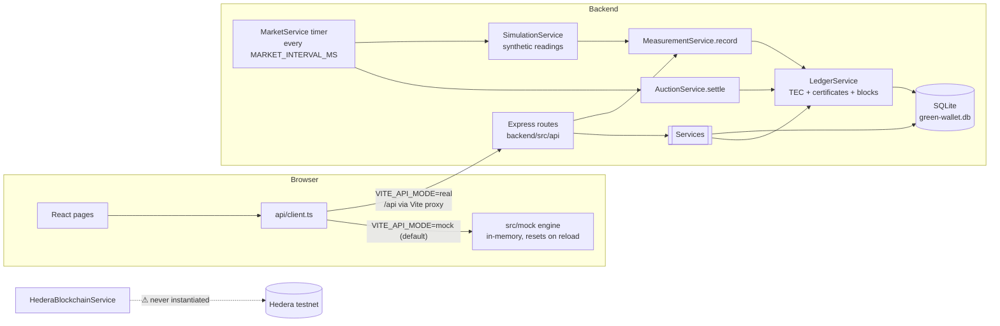
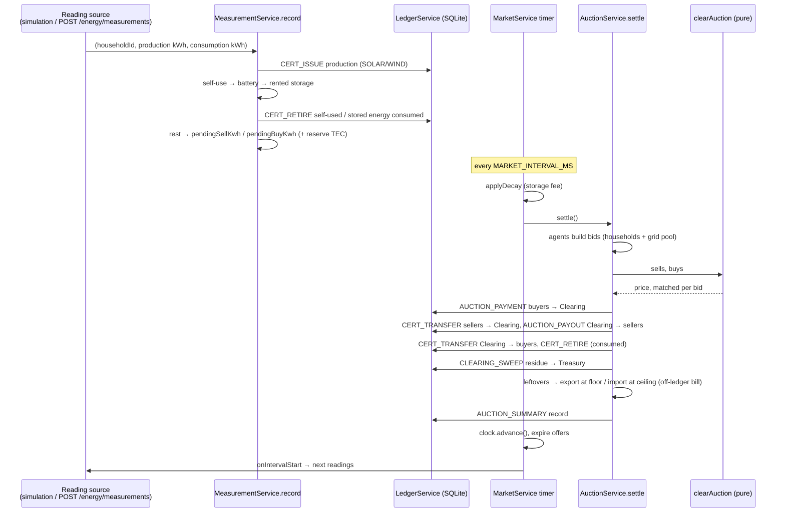
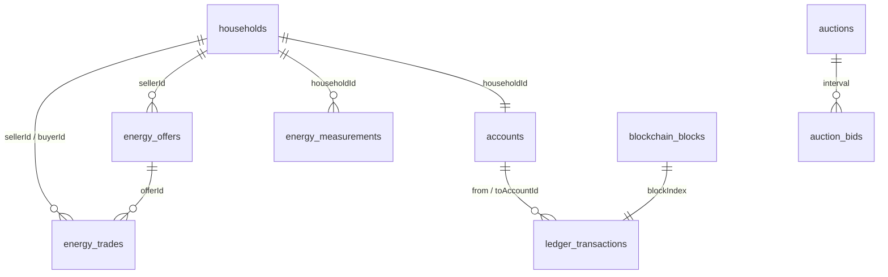

# Green Wallet: how the application works

This is a code-level explanation for a teammate who did not write the code. Your task is to choose a real electricity dataset and replay it through the app, so this document concentrates on **what data the app expects and what it does with it**.

Every statement points to the code: `file:line`, or `file → function`. Paths are relative to the repository root. Anything that is mocked, hard-coded, unused or only planned is marked **⚠**.

---

## 1. Overview

### What the app does

Green Wallet simulates a **local energy market (a microgrid)** of households: producers (solar and wind farms), prosumers (homes with rooftop solar and optional batteries) and consumers.

1. Every market interval (30 simulated minutes by default), each household reports **one meter reading: production and consumption in kWh for that interval**.
2. The app covers each household's own needs first: self-consumption, then its home battery, then its rented space in a shared community battery.
3. Whatever is left becomes a surplus to sell or a deficit to buy. Automatic agents turn these into bids in a **uniform-price double auction** run at the end of each interval.
4. Anything the auction can't match goes to the "main utility grid": surplus is exported at a floor price and deficit is imported at a ceiling price.
5. Money is a token called **TEC**. Green energy is tracked with **SOLAR / WIND certificates (1 certificate = 1 kWh)**.
6. Every money or certificate movement is written to a **simulated Hedera-style ledger** (hash-chained blocks in SQLite). **⚠ Nothing is sent to the real Hedera network.**
7. There is also a manual fixed-price **marketplace** (offers and purchases between households).

### Tech stack

| Layer | Technology | Where |
|---|---|---|
| Backend | Node.js, TypeScript (ES modules), Express 4, zod validation, JWT auth (jsonwebtoken), bcryptjs, ws (WebSocket), express-rate-limit | `backend/package.json` |
| Database | SQLite through better-sqlite3 (synchronous); one file, default `backend/data/green-wallet.db` | `backend/src/db/database.ts`, `backend/src/config/env.ts:37` |
| Ledger | **Simulated** hash-chained ledger in SQLite (`LedgerService` + `blockchain_blocks`) | `backend/src/services/ledgerService.ts` |
| Hedera SDK | `@hashgraph/sdk` ^2.53.0, imported **only** by unused code (`HederaBlockchainService.ts`) and a one-off script (`scripts/initToken.ts`) | `backend/package.json`, `backend/src/blockchain/index.ts:11-13` |
| Frontend | React 18, react-router-dom 6, recharts, Vite 5; a browser-side mock engine | `frontend/package.json`, `frontend/src/mock/` |
| Tests | vitest + supertest (11 unit test files, 5 integration test files) | `backend/tests/` |
| Deployment | Dockerfiles + `docker-compose.yml` (backend on :4000, nginx frontend on :8080) | `docker-compose.yml` |

There are no other external services: no message queue, no cloud and no real smart meters.

### Folder structure

```
backend/
  src/
    server.ts            boot: env check, DB, container, auto-seed, start market clock + simulation
    app.ts               Express app: CORS, rate limits, /health, /api router, error handling
    container.ts         dependency injection: builds every service once
    config/env.ts        all configuration (env vars + defaults), price band, validation
    db/
      schema.sql         the whole schema (applied on every boot)
      database.ts        opens SQLite, wipes the DB when the schema version changes
      repositories/      one class per table (SQL lives here)
    domain/types.ts      backend domain types (mirrors frontend/src/types.ts)
    services/            business logic (ledger, measurements, auction, grid storage, marketplace, ...)
    market/clearing.ts   the pure double-auction clearing algorithm
    simulation/          synthetic meter-reading generator (curves.ts + simulationService.ts)
    blockchain/          ledger abstraction; LocalBlockchainService (used); HederaBlockchainService (⚠ unused)
    api/routes/          REST endpoints, one file per area
    middleware/          JWT auth, request validation, error handler
    ws/                  WebSocket notification hub (⚠ the frontend does not connect to it)
    scripts/             seed.ts / seedData.ts (demo households), initToken.ts (⚠ real Hedera, unused)
  tests/                 unit + integration tests
frontend/
  src/
    api/client.ts        fetch wrapper; chooses mock or real mode
    mock/                a complete in-browser copy of the backend logic (used in mock mode)
    pages/               one file per screen
    components/          shared UI: map (LivingGrid), charts, badges, ...
    types.ts             the API contract shared by mock and real modes
docs/                    DESIGN.md (the design spec), ARCHITECTURE.md, API.md
```

### Architecture



---

## 2. Users and roles

| Role | Stored as | What it represents |
|---|---|---|
| `producer` | `households.type` | A solar or wind **farm**. Sells its whole output in the auction. |
| `prosumer` | `households.type` | A home with rooftop **solar** and an optional home battery. |
| `consumer` | `households.type` | A home that only consumes. |
| operator accounts | `accounts.kind` | Not users. Five system ledger accounts: Operator `0.0.1000`, Treasury `0.0.1001`, Clearing `0.0.1002`, Grid storage (the community battery's "grid pool") `0.0.1003`, Main utility grid `0.0.1004` (`ledgerService.ts:19-24`, created in `bootstrap()` `ledgerService.ts:58-88`). |

There is an **operator console** (`/admin`), signed in with `OPERATOR_PASSWORD` (`POST /api/auth/operator-login`). The operator can add households of any role and credit TEC from the treasury (§9). It is not a household and has no ledger account of its own beyond the system accounts.

**How a role is decided:** it is **fixed at registration** and never recomputed from energy data. It comes from `type` in `POST /api/auth/register` (`auth.routes.ts:12-23`, `authService.ts:60-117`). The schema only allows the three values (`schema.sql:7`).

Rules tied to the role, all enforced in the backend:

| Rule | Code |
|---|---|
| Energy source per role: producer = `solar` or `wind`; prosumer = `solar` only; consumer = `grid` | `authService.ts:14-21` |
| Only prosumers may have a home battery (0–`HOUSEHOLD_MAX_BATTERY_CAPACITY_KWH`, default 50 kWh) | `authService.ts:37-47` |
| A consumer reading with production > 0 is **rejected** | `measurementService.ts:70` |
| Producers cannot create marketplace offers ("producers sell through the auction only") | `marketplaceService.ts:36` |
| Only prosumers get the overflow choice (`sell` / `store`) and battery selling | `householdService.ts` → `resolveSettings` (overflow forced to `sell` and battery selling disabled for other roles) |
| Welcome grant (`WELCOME_GRANT_TEC`, default 10 TEC) for prosumers and consumers, **not producers** | `authService.ts:110-112` |
| Only prosumers use the home battery and rented storage when they have a surplus | `measurementService.ts:87-95` |

What every logged-in household can do (routes in §9):
- submit manual readings, if enabled;
- change its agent settings (price limits, overflow mode, battery selling, auction opt-out);
- list and buy marketplace offers (producers can't list);
- top up or cash out simulated TEC, if enabled;
- read public data (dashboard, auctions, ledger, blocks) and the household directory.

Private data (wallet, token history, trade history, meter history) can only be read by the household itself, enforced by `assertSelf` (`middleware/auth.ts:41-45`).

---

## 3. Wallets and Hedera accounts

### What actually runs (simulated ledger)

- **Account creation:**
  - Registration creates one ledger account per household inside the same database transaction as the household row (`authService.ts:107-113` → `ledgerService.ts` `createHouseholdAccount` `:90-104`).
  - Account IDs are Hedera-style strings starting at `0.0.4801` and counting up (`ledgerService.ts:26`, `nextHouseholdAccountNumber` `:313-320`).
- **No keys, no signing:** no private key is generated for any user, and no user signs anything. The backend changes balances directly in SQLite. The model is fully custodial and server-side, with no HashPack or other wallet.
- **Hedera columns stay empty:** `households.hederaAccountId` and `hederaPrivateKeyEncrypted` exist (`schema.sql:10-11`) but are always `null` (`authService.ts:84-85`).
- **No token association:** the simulated ledger has no association step.
- **Network label only:** `GET /api/blockchain/status` reports `"network": "testnet (simulated)"` (`ledgerService.ts:269-281`).

### ⚠ Real Hedera code that exists but is never used

`backend/src/blockchain/HederaBlockchainService.ts` contains a real integration:

| Function | What it would do | Lines |
|---|---|---|
| `client()` | `Client.forTestnet()`, operator = `HEDERA_OPERATOR_ID` with an **ECDSA** key from `HEDERA_OPERATOR_KEY` | 50-54 |
| `provisionAccount()` | New **ED25519** key, `AccountCreateTransaction` with 10 HBAR, `TokenAssociateTransaction` for `HEDERA_TOKEN_ID` signed by the new key, private key encrypted (AES-256-GCM, key derived from `KEY_ENCRYPTION_SECRET`, `utils/crypto.ts:4-17`) | 56-79 |
| `recordTransaction()` | Mirrors to the local chain, then `TokenMintTransaction` (MINT) or `TransferTransaction` (TRANSFER/TRADE) signed with the sender's decrypted key | 81-104 |

It is never selected: `createBlockchainService` always returns `LocalBlockchainService` (`blockchain/index.ts:11-13`). Nothing in the services calls `container.blockchain.recordTransaction` either. The only uses of `container.blockchain` are the explorer's read routes (`blockchain.routes.ts`). If the `HEDERA_*` variables are set, the server only logs a warning and ignores them (`server.ts:26-28`).

⚠ **README conflict:** `README.md` ("Blockchain mode: local vs. real Hedera testnet") says that setting the three variables and running `npm run init:token` switches the app to real Hedera. **The code does not do this.**

**Environment variable names (no values):** `HEDERA_OPERATOR_ID`, `HEDERA_OPERATOR_KEY`, `HEDERA_TOKEN_ID`, `KEY_ENCRYPTION_SECRET` (`env.ts:98-102`).

---

## 4. The energy token(s)

The app uses **three simulated assets plus one record type** (`schema.sql:156`: `asset IN ('TEC','SOLAR','WIND','RECORD')`).

| Asset | Meaning | Unit | Fake "token ID" | Code |
|---|---|---|---|---|
| **TEC** | **Money.** The payment token for energy. It is **not energy**. | 1 TEC = 1 unit of money; prices are in TEC/kWh; amounts are rounded to 0.01 | `0.0.5001` | `ledgerService.ts:27`, `round2` `:365-367` |
| **SOLAR** | Green certificate for solar energy | 1 certificate = **1 kWh**; resolution 0.01 kWh (amounts that round to 0 are skipped, `:294`) | `0.0.5002` | `ledgerService.ts:146-165` |
| **WIND** | Green certificate for wind energy | 1 certificate = **1 kWh** | `0.0.5003` | same |
| RECORD | One summary entry per auction (mirrors a Consensus Service message) | kWh volume | — | `ledgerService.ts:168-170` |

⚠ The token IDs are **hard-coded labels**, not real Hedera tokens (`ledgerService.ts:27`). There are no admin, KYC, freeze, wipe or supply keys in the simulated model. Balances are SQL columns: `accounts.balance`, `reservedBalance`, `solarBalance`, `windBalance` (`schema.sql:44-55`).

**Energy itself is not a token.** Physical kWh are tracked as numbers on the household (`batteryKwh`, `storedKwh`, `pendingSellKwh`, `pendingBuyKwh` in `schema.sql:16-21`) and in the grid pool (`grid_storage.poolKwh`). Certificates are the only on-ledger representation of energy.

**When things are created, moved and destroyed**

| Event | Ledger operation | Code |
|---|---|---|
| Server first boot | TEC created into the Treasury (`TREASURY_INITIAL_TEC`, default 10,000); 500 TEC moved Treasury → Grid storage | `ledgerService.ts:74-85` |
| Registration (prosumer or consumer) | `WELCOME_GRANT` Treasury → household | `authService.ts:110-112` |
| Demo seed (consumers) | `SEED_TOPUP` creates TEC on the household | `seedData.ts:59-62` |
| Top-up / cash-out (simulated payment) | `TOPUP` creates TEC / `CASHOUT` destroys TEC | `tokenService.ts` `topup` (line 64), `cashout` (line 88) |
| Every reading with production > 0 | `CERT_ISSUE` of SOLAR or WIND, equal to the production in kWh (issued by "null", i.e. created) | `measurementService.ts:78-79` |
| Energy consumed (self-use, from storage, bought) | `CERT_RETIRE` (destroyed) | `measurementService.ts:129-133`, `auctionService.ts` `consume` `:337-342` |
| Energy sold or exported | `CERT_TRANSFER` with the kWh | `auctionService.ts:194-240`, `tradeService.ts:127-128` |
| Auction payment | `AUCTION_PAYMENT` buyer → Clearing, then `AUCTION_PAYOUT` Clearing → seller, residue `CLEARING_SWEEP` → Treasury | `auctionService.ts:179-237` |
| Marketplace purchase | `TRADE_SETTLEMENT` buyer → seller | `tradeService.ts` `executeTrade` `:109-116` |

There is **no minting of TEC for production**: "There is no minting: production earns certificates" (`tokenService.ts:13`).

⚠ **Inconsistency:** the unused Hedera code still assumes "1 kWh of tokenized energy == 1.00 TEC" (`HederaBlockchainService.ts:23-25`) and mints TEC per kWh. That is an older model; the current model uses TEC as money.

⚠ The unused `scripts/initToken.ts:28-38` would create a real HTS **fungible** token "Tunisian Energy Coin" (symbol TEC, **2 decimals**, initial supply 1,000,000 units = 10,000.00 TEC, infinite supply, treasury = operator, admin key and supply key = operator key; **no KYC, freeze or wipe keys**).

**HBAR:** there are no HBAR balances. Every ledger transaction stores a simulated fee `feeHbar` (`SIMULATED_FEE_HBAR`, default 0.0001, `ledgerService.ts:353`). It is **only recorded**, never deducted from any account, and the UI shows it as "paid by the operator". There is no stablecoin.

---

## 5. Energy data input (the most important section for your task)

### Where readings enter

All three entry points end in one function: **`MeasurementService.record(householdId, production, consumption, source, timestamp?)`** (`backend/src/services/measurementService.ts:51-156`).

| Entry | How | Code | Status |
|---|---|---|---|
| **Synthetic generator** | At the start of every market interval, one reading per household from mathematical curves | `simulation/simulationService.ts:44-50` → `curves.ts` `simulateReading` | Default in development (`SIMULATION_ENABLED`, `env.ts:42`) |
| **Manual API** | `POST /api/energy/measurements` with the household's JWT | `api/routes/energy.routes.ts:50-66` | On in development (`MANUAL_MEASUREMENTS_ENABLED`, `env.ts:54`). Limited to one reading per household every `MEASUREMENT_MIN_INTERVAL_MS` (default 60,000 ms) and 120 writes per minute globally (`app.ts:21`) |
| **Seed** | One first reading per demo household | `scripts/seedData.ts:64` | Runs once on an empty DB |
| File upload / CSV import / smart-meter integration | — | — | **⚠ Not implemented** |

### Exact format

The input is just **two numbers per household per interval**:

```jsonc
// POST /api/energy/measurements   (Authorization: Bearer <JWT of the household>)
{ "production": 8, "consumption": 3 }      // from backend/tests/integration/api.test.ts:53
```

| Field | Type | Unit | Meaning | Validation |
|---|---|---|---|---|
| `production` | number | **kWh** | Energy produced **during this interval**. **Not** power (kW), **not** a cumulative meter index. | finite, ≥ 0 (`energy.routes.ts:11-16`); ≤ `MEASUREMENT_MAX_KWH` (default **50**, `measurementService.ts:63-65`); must be **0 for consumers** (`:70`) |
| `consumption` | number | **kWh** | Energy consumed during this interval | finite, ≥ 0; ≤ `MEASUREMENT_MAX_KWH` |

- **Not in the body:** the household ID comes from the JWT, and the body is strict (extra fields are rejected).
- **Values are per interval:** the built-in profiles are explicitly "in kWh per 30-minute interval" (`simulation/curves.ts:4`).
- **Timestamps:** the dataset's time is **not used**.
  - The reading gets `simTime` and `interval` from the app's own clock (`measurementService.ts:142-143`).
  - `timestamp` defaults to the server's `Date.now()` (Unix ms) and is only stored.
  - The API has no timestamp field and no timezone handling.
  - `simTime` is "simulated minutes since day 1, 00:00" (`frontend/src/format.ts`), and the clock **starts at day 1, 06:00** (`clockService.ts:4`).

### Time step

- **Interval length:**
  - Default **30 simulated minutes** (`MARKET_INTERVAL_SIM_MINUTES`, `env.ts:49`).
  - It must divide a day evenly: 15, 30, 60… (`env.ts:188-189`).
- **Real-time pace:**
  - Each interval lasts `MARKET_INTERVAL_MS` real ms (default 5000, `env.ts:48`).
  - At 5 s per 30-minute interval, one simulated day takes 4 real minutes.
- **The market clock always runs:** it starts on boot even when the simulation is off (`server.ts:42`). It **cannot be disabled by configuration**, only slowed by raising `MARKET_INTERVAL_MS`.
- ⚠ **Hard-coded 30-minute assumption:** the built-in synthetic curves output kWh per 30 minutes regardless of `MARKET_INTERVAL_SIM_MINUTES` (`curves.ts:4`). Changing the interval makes the synthetic data the wrong scale. Real data must be pre-aggregated to the chosen interval.

### What the app computes from the two numbers

`MeasurementService.record` (`measurementService.ts:68-153`) does the following, in one database transaction:

1. **Certificates issued** for all production: SOLAR, or WIND for a wind producer (`:73`, `:78-79`).
2. **Self-use** = min(production, consumption); those certificates are retired (`:81-83`, `:129-133`).
3. **Surplus** (production > consumption), in this order:
   - prosumer home battery, up to free capacity (`:88`);
   - then, in `store` mode, the household's rented space in the shared battery (`:90-93`, `GridService.storageSpace` `gridService.ts:61-63`);
   - the rest waits for the auction (`pendingSellKwh`, `:103-104`);
   - if the household opted out of the auction, the rest is exported immediately at the floor price (`:96-101`).
4. **Deficit**, in this order:
   - home battery, then rented storage (`:108-117`);
   - the rest waits for the auction as `pendingBuyKwh`, with TEC reserved for it (`:122-125`, `auctionService.ts:65-73`);
   - if opted out, it is imported immediately at the ceiling (`:119-121`).
5. **Stored values:**
   - `households.currentProduction` / `currentConsumption` are overwritten with this reading (`:136`), and they feed the map and dashboard;
   - a row is written to `energy_measurements` (`:138-150`) with the flow breakdown.

**The dataset does not need to supply** net energy, battery state of charge, or grid import/export. The app **computes all of them**:

| Value | Where it is computed |
|---|---|
| Battery charge | `measurementService.ts:88`, `:108` |
| Grid import / export | Auction imbalance, `auctionService.ts:244-267`; stored in `households.importedKwh` / `exportedKwh` and per reading in `energy_measurements.importedKwh` / `exportedKwh` |

Any import/export or SoC columns in your dataset can only be used to **compare** against what the app computes.

### Real example (live backend, `GET /api/energy/measurements?limit=1`)

```json
{
  "id": "a2d8e87b-8f48-4b85-a40f-1dcac2e99652",
  "householdId": "prosumer-2",
  "timestamp": 1791564301881,
  "simTime": 78000,
  "interval": 2588,
  "production": 0,
  "consumption": 0.35,
  "surplus": -0.35,
  "source": "simulation",
  "flow": { "selfUse": 0, "toBattery": 0, "toStorage": 0, "toAuction": 0, "fromBattery": 0,
            "fromStorage": 0.35, "toBuy": 0, "sold": 0, "exported": 0, "bought": 0,
            "imported": 0, "price": null, "settled": true }
}
```

Here a night-time deficit of 0.35 kWh was covered from the household's rented storage, so nothing went to the auction.

### Every place mock, sample or seed energy data exists

| Location | What it is | How to replace it |
|---|---|---|
| `backend/src/simulation/curves.ts` (`householdProfile` line 39, `solarFactor` 55, `windFactor` 61, `householdLoad` 67, `simulateReading` 72) | Synthetic per-role curves: solar sine from 06:00 to 18:00, wind with gusts, morning and evening load peaks, random noise; farms consume 0 (`:85-86`) | Replace the `simulateReading(...)` call in `SimulationService.recordReadings` (`simulationService.ts:47`) with a lookup into your dataset by `(household id, clock.interval())`. Or turn it off (`SIMULATION_ENABLED=false`) and feed readings yourself (§11). |
| `backend/src/scripts/seedData.ts:27-39` | The 11 demo households (2 producers, 5 prosumers, 4 consumers), their batteries, price limits and one first reading each; seed top-ups for consumers | Edit `SEED_HOUSEHOLDS` to match your dataset's meters (IDs, roles, battery sizes), or register households through `POST /api/auth/register`. |
| `seedData.ts:57` → `GridService.injectInitialCharge` (`gridService.ts:97-104`) | Demo batteries start **half full** of grey energy | Remove or adapt it for your scenario. |
| `GridService` constructor (`gridService.ts:45`) | The grid pool starts at `GRID_POOL_INITIAL_SHARE` (50%) of its capacity | Set `GRID_POOL_INITIAL_SHARE`. |
| `backend/src/simulation/simulationService.ts` → `demoMarket()`; mirrored in `frontend/src/mock/engine.ts` → `demoMarket()` | **Demo neighbours** (only in the live simulation, `DEMO_MARKET_ACTIVITY`, default on in development): every 4 intervals a prosumer lists part of its stored energy on the marketplace, every 3 intervals a neighbour buys from an open offer, and once a simulated day wallets under 5 TEC get a simulated 20 TEC top-up. They go through the normal `createOffer` / `purchase` / `TOPUP` paths. Not called by `runInterval()`, so tests and replays stay deterministic. | Set `DEMO_MARKET_ACTIVITY=false` for a run that should contain only your dataset's behaviour. |
| `frontend/src/mock/` (`engine.ts`, `profiles.ts`, `config.ts`) | A full in-browser copy of the backend, with its own synthetic profiles (`profiles.ts` mirrors `curves.ts`). **This is the default frontend mode.** | Run the frontend with `VITE_API_MODE=real` so the screens show backend data. |

---

## 6. Trading and matching logic

### Surplus and deficit

These are computed per reading as `surplus = production − consumption` (`measurementService.ts:75`). Own resources are used first (§5). Only what's left becomes the auction's `pendingSellKwh` / `pendingBuyKwh` (`schema.sql:20-21`). Several readings in one interval **add up** (`householdRepository.ts` `adjustPending`, line 61).

### Bids are automatic

Nobody bids by hand in the auction. At the end of each interval, **automatic agents** create bids from each household's stocks and its one-time settings (`auctionService.ts` `householdBids` `:76-107`):

| Bid | Quantity | Limit price |
|---|---|---|
| sell `surplus` | `pendingSellKwh` | `minSellPrice` |
| sell `storage` (prosumer, `store` mode) | rented storage minus kWh listed in offers | `storeMinPrice` |
| sell `battery` (prosumer, battery selling on) | battery − keep-reserve % − listed kWh | `batterySell.minPrice` |
| buy `deficit` | min(`pendingBuyKwh`, reserved TEC / `maxBuyPrice`) | `maxBuyPrice` |
| grid pool sell / buy (operator) | pool charge / free room (and what Grid storage can afford) | 24-hour average × 1.1 / × 0.9, clamped to the band (`gridService.ts:146-151`, `auctionService.ts:163-170`) |

A household never buys and sells in the same interval (`:78-84`). Bids under 0.001 kWh are dropped (`:27`).

**Default limits** (`householdService.ts` `defaultSettings`, line 13):
- sell from the floor;
- buy up to the ceiling;
- stored energy sells from mid-band;
- battery selling off (if enabled, its minimum price defaults to ceiling − 0.05).

Users change these in the UI (Battery & Settings, `POST /api/households/me/settings`). All prices must sit inside the floor–ceiling band (`householdService.ts` `resolveSettings`).

### Matching: a uniform-price double auction

The algorithm is in `backend/src/market/clearing.ts` (`clearAuction`, line 65). It is pure and has its own unit tests (`tests/unit/clearing.test.ts`).

1. Sellers are sorted by limit, ascending (merit order). Buyers are sorted descending. Bids at the same price form one level.
2. Levels match from the top while the next seller's ask ≤ the next buyer's limit.
3. **One price for everyone:** halfway between the last matched seller's and the last matched buyer's limits (k = 0.5), rounded to 0.001 (`clearing.ts:95`).
4. Whole levels fill in order. The **marginal level is shared pro rata** to quantity (`allocate`, `clearing.ts:49-63`).

### Settlement (`AuctionService.settle`, `auctionService.ts:135-300`)

This runs inside one database transaction opened by `MarketService.endInterval` (`marketService.ts:53-61`).

1. A household that both produced and lacked energy this interval covers itself first (`:146-154`).
2. Build all bids (`:156-170`), then clear them (`:173-176`).
3. Buyers' reservations are released, and buyers pay `matched × price` (rounded up) into **Clearing** (`:179-191`).
4. Sellers deliver the energy and its certificates into Clearing and are paid `matched × price` (rounded down) (`:194-209`).
5. Buyers receive their pro-rata share of the certificates, and the energy is **consumed immediately**, with its certificates retired (`:212-233`).
6. Rounding residue: TEC goes to the Treasury and certificate dust goes to the Utility (`:236-240`).
7. **Unmatched energy goes to the utility.** Remaining `pendingSellKwh` is **exported at the floor**, with its certificates handed to the Utility account. Remaining `pendingBuyKwh` is **imported at the ceiling** (`:244-267`).
8. Each household's latest reading for the interval gets `sold / exported / bought / imported` and the price (`:270-272`, `measurementRepository.ts` `settleInterval` `:81-96`).
9. One row in `auctions` and its bids in `auction_bids`, plus one `AUCTION_SUMMARY` ledger record (`:275-298`).

**Utility money is off the ledger.** Import cost (kWh × ceiling) and export credit (kWh × floor) only accumulate in `households.importCost` / `exportCredit` (`schema.sql:32-35`), shown as the "utility statement". The utility never pays or charges TEC.

### Prices

| Price | Value (defaults) | Defined in |
|---|---|---|
| Ceiling (utility import price) | wholesale 0.08 + network 0.09 + taxes 0.08 + margin 0.05 = **0.30 TEC/kWh** | `env.ts:78-82`, `priceBand` `:116-132` |
| Floor (utility export price) | wholesale 0.08 − balancing 0.03 = **0.05 TEC/kWh** | same |
| Mid | (floor + ceiling) / 2 = 0.175 | same |
| Clearing price | Market result, always inside the band (all limits are inside it) | `clearing.ts:95` |
| Marketplace price | Seller sets it, within the band | `marketplaceService.ts:39-43` |

### The manual marketplace (separate from the auction)

- **Creating an offer** (prosumers and consumers only): `POST /api/market/offers` (`marketplaceService.ts:33-74`).
  - Amount ≥ 0.1 kWh, price within the band.
  - The seller can only list energy they **already hold**: stored energy plus battery above the keep-reserve, minus kWh already listed (`gridService.ts:70-75`).
  - Offers expire after `OFFER_EXPIRY_SIM_HOURS` (default 24 simulated hours, `:46`).
- **Buying:** `POST /api/market/offers/:id/purchase` (`tradeService.ts` `purchase` → `createTrade` + `executeTrade`).
  - Bought kWh go into the **buyer's rented space** in the shared battery, so the buyer needs free space (`assertCanReceive`, `tradeService.ts:163`).
  - Settlement moves TEC buyer → seller, moves kWh from the seller's storage (then battery), and moves certificates with them, all in one DB transaction (`tradeService.ts:92-140`).

### Other rules and limits

- Rented space per household: 10 kWh (`RENTED_CAP_PER_HOUSEHOLD_KWH`).
- Shared battery: 100 kWh total, 60% rented to households and 40% grid pool (`env.ts:87-91`, `gridService.ts:48-58`).
- **Storage fee:** stored kWh decay by 1% per simulated hour into the grid pool, and their certificates are retired (`gridService.ts:111-136`).
- No distance or network-topology rules. ⚠ The map's "neighbours" are only a visual layout.

---

## 7. End-to-end transaction flow



Every `L` arrow is one ledger row plus **one new hash-chained block** (`ledgerService.ts` `recordTx` `:323-362`):
- transaction ID `0.0.1000@<unix seconds>.<9-digit sequence>` (`:334`);
- a SHA-256 block with a 2-zero proof-of-work (`blockchain/hash.ts` `mineBlock`).

- **Hedera transactions used:** **none.** `TokenMintTransaction`, `TransferTransaction`, `AccountCreateTransaction` and `TokenAssociateTransaction` are built only in the unused `HederaBlockchainService.ts`. `TokenCreateTransaction` is built only in `scripts/initToken.ts`. `ConsensusSubmitMessage` / HCS is **not used anywhere**. The per-auction `AUCTION_SUMMARY` row "mirrors a Hedera Consensus Service message" (`ledgerService.ts:167`) but stays local. There are no topic IDs.
- **Atomicity:** each settlement runs in **one SQLite transaction**: the whole interval (`marketService.ts:54`), a marketplace trade (`tradeService.ts:100`), and each ledger transfer (`ledgerService.ts:121`). Payment and energy/certificate movements are separate ledger rows in the same database transaction, not an on-chain atomic swap.
- **Off-chain vs on-chain:** everything is off-chain (SQLite). The "chain" is the `blockchain_blocks` table plus `ledger_transactions`.
- **Errors:**
  - A transfer throws on insufficient available balance (`ledgerService.ts:125-129`), and certificates throw on insufficient holdings (`:298-301`).
  - Auction payments are capped by the payer's balance, and zero amounts are skipped (`auctionService.ts:186`, `:303-306`).
  - If a whole interval fails, its transaction rolls back, the error is logged, and the next tick tries again (`marketService.ts:83-93`).
  - A failed marketplace trade returns the kWh to the offer and is marked `failed` (`tradeService.ts` `releaseAndFail` `:171-181`).
  - There is no network retry logic, because there are no network calls.

---

## 8. Database (SQLite, `backend/src/db/schema.sql`)

The schema is applied on every boot. If `PRAGMA user_version` differs from `CURRENT_SCHEMA_VERSION` (4), **all tables are dropped and rebuilt** (`database.ts:9`, `:26-36`). Changing the schema therefore wipes the data.

| Table | Purpose | Key fields |
|---|---|---|
| `households` (`:4-42`) | One row per participant; holds its **live state** | `id`, `name`, `type`, `location`, `passwordHash`, `energyType`; latest reading `currentProduction`/`currentConsumption`; stocks `batteryCapacityKwh`, `batteryKwh`, `storedKwh`; this interval's `pendingSellKwh`/`pendingBuyKwh`; agent settings (`overflowMode`, `minSellPrice`, `maxBuyPrice`, `storeMinPrice`, `batterySell*`, `auctionOptOut`); utility statement (`importedKwh`, `importCost`, `exportedKwh`, `exportCredit`); lifetime `consumedKwh`/`consumedSolarKwh`/`consumedWindKwh`; ⚠ unused `hederaAccountId`, `hederaPrivateKeyEncrypted` |
| `accounts` (`:44-55`) | Ledger accounts (households + 5 operator accounts) | `id` (`0.0.N`), `kind`, `householdId` (unique), `label`, `balance`, `reservedBalance` (TEC held for a pending buy), `solarBalance`, `windBalance` |
| `grid_storage` (`:59-67`) | Single row: the operator's grid pool | `poolKwh`, `initialStockKwh` (pre-charged energy, for the energy check), `operatorExportedKwh` |
| `energy_measurements` (`:69-94`) | **Every meter reading** and where its energy went | `householdId`, `timestamp` (ms), `simTime`, `interval`, `source` (`simulation`/`manual`), `production`, `consumption`, `surplus`, flow columns `selfUseKwh…importedKwh`, `price`, `settled` |
| `auctions` (`:97-108`) | One row per settled interval (the price history) | `interval` (PK), `simTime`, `clearingPrice` (null = no match), `volume`, `lastMatchedSell/BuyPrice`, `exportedKwh`, `importedKwh`, `avg24h` |
| `auction_bids` (`:110-121`) | Every bid of every auction | `interval`, `participantId` (household id or `grid-pool`), `side`, `source`, `quantity`, `limitPrice`, `matched` |
| `energy_offers` (`:123-134`) | Marketplace offers | `sellerId`, `amountKwh`, `amountRemainingKwh`, `pricePerKwh`, `status`, `expiresAtSimTime`/`expiresAtInterval` |
| `energy_trades` (`:136-151`) | Marketplace purchases | `offerId`, `sellerId`, `buyerId`, `amountKwh`, `pricePerKwh`, `totalPrice`, `status`, `ledgerTxId`, `certSolarKwh`, `certWindKwh`, `simTime` |
| `ledger_transactions` (`:153-166`) | Every money, certificate or record movement | `id` (Hedera-style), `type`, `asset`, `fromAccountId` (null = created), `toAccountId` (null = destroyed), `amount`, `feeHbar`, `memo`, `timestamp`, `simTime`, `blockIndex`, `relatedTradeId` |
| `blockchain_blocks` (`:168-176`) | Hash chain, one transaction per block | `idx`, `timestamp`, `simTime`, `previousHash`, `hash`, `nonce`, `transactionIds` (JSON array) |
| `meta` (`:178-181`) | Key/value store: the simulated clock (`simTime`, `interval`) | `key`, `value` |



`auction_bids.participantId` is not a foreign key, because it can also be `grid-pool`.

---

## 9. API

- **Base path:** `/api`.
- **Responses:** `{ "success": true, "data": ... }` on success, `{ "success": false, "error": { "code", "message" } }` on error.
- **Auth:** 🔒 means the endpoint needs `Authorization: Bearer <JWT>` from login or register; 👤 means it is restricted to the caller's own household. 🛠 means operator token only (`requireOperator`, `middleware/auth.ts`); a household token gets 403.
- **Rate limits:** 120 writes and 600 reads per minute per client (`app.ts:21-22`).
- **Health check:** `GET /health` → `{ "status": "ok" }` (`app.ts:24`).

| Method | Path | Purpose | Body / query | Code |
|---|---|---|---|---|
| POST | `/auth/register` | Create a household (+ ledger account, welcome grant) | `{ id?, name, type, location?, password, energyType?, batteryCapacityKwh? }` → `{ household, token }` | `auth.routes.ts`, `registerSchema` |
| POST | `/auth/login` | Log in | `{ id, password }` → `{ household, token }` | `auth.routes.ts` |
| POST | `/auth/operator-login` | Operator console sign-in (`OPERATOR_PASSWORD`). The token's subject is `@operator`, which no household ID can be, so it cannot read any household's private data | `{ password }` → `{ token }` | `auth.routes.ts` |
| POST 🛠 | `/admin/households` | Operator adds a producer, prosumer or consumer (same rules and welcome grant as a self-registration; the operator is not logged in as it) | same body as `/auth/register` → the new household | `admin.routes.ts` |
| POST 🛠 | `/admin/households/:id/credit` | Operator credits TEC to a household **from the treasury** (a transfer: the money supply does not change) | `{ amount }` (≤ 1000) → the household | `admin.routes.ts` |
| GET 🔒 | `/households` | Directory of all households (⚠ includes everyone's `tokenBalance` and `settings`) | — | `households.routes.ts:29` |
| GET 🔒 | `/households/me/settings` | My agent settings | — | `:37` |
| POST 🔒 | `/households/me/settings` | Update agent settings | partial `{ overflowMode, minSellPrice, maxBuyPrice, storeMinPrice, batterySell{enabled,minPrice,keepPercent}, auctionOptOut }` | `:44` |
| GET 🔒 | `/households/:id` | One household (⚠ also returns balance and settings for **other** households) | — | `:52` |
| GET 🔒👤 | `/households/:id/history?limit=` | My meter readings | — | `:60` |
| GET 🔒 | `/energy/measurements?limit=` | My meter readings | — | `energy.routes.ts:22` |
| POST 🔒 | `/energy/measurements` | **Submit a reading** | `{ production, consumption }` (kWh this interval) → `{ measurement, settlesInMs, certificateTx, retired }` | `:50` |
| GET | `/market/status` | Clock, interval, countdown, price band, last price, 24 h average | — | `market.routes.ts:15` |
| GET | `/market/price-history?limit=` | Settled auctions (price, volume, export/import) | default 48, max 1000 | `:23` |
| GET | `/market/auctions/latest` | Last auction with all bids | — | `:31` |
| GET 🔒 | `/market/my-bid` | What my agent bids this interval | — | `:39` |
| GET | `/market/offers` | Active marketplace offers | — | `:47` |
| POST 🔒 | `/market/offers` | Create an offer | `{ amountKwh, pricePerKwh }` | `:54` |
| GET 🔒 | `/market/offers/mine` | My offers | — | `:65` |
| GET | `/market/offers/:id` | One offer | — | `:73` |
| POST 🔒 | `/market/offers/:id/cancel` | Cancel my offer | — | `:80` |
| POST 🔒 | `/market/offers/:id/purchase` | Buy from an offer (sends a WebSocket `TRADE_COMPLETED` to the seller) | `{ amountKwh }` | `:89` |
| GET 🔒👤 | `/trades?householdId=` | My marketplace trades | — | `trades.routes.ts:13` |
| GET 🔒 | `/trades/:id` | One of my trades (404 if not mine) | — | `:22` |
| GET 🔒👤 | `/wallet/:householdId` | Balance, reserved, certificates, green share, utility statement | — | `wallet.routes.ts:16` |
| POST 🔒 | `/wallet/topup` | Simulated top-up | `{ amount }` (≤ `TOPUP_MAX_TEC`, cooldown) | `:25` |
| POST 🔒 | `/wallet/cashout` | Simulated cash-out | `{ amount }` | `:34` |
| GET 🔒👤 | `/tokens/balance/:householdId` | TEC balance | — | `tokens.routes.ts:12` |
| GET 🔒👤 | `/tokens/history/:householdId?limit=` | My ledger movements | default 100 | `:20` |
| GET | `/transactions?limit=&asset=` | Public ledger; `asset` = `ALL`, `TEC`, `CERT` or `RECORD` | default 200 | `transactions.routes.ts:14` |
| GET | `/blockchain/status` | Ledger status (fake token IDs, block count, total fees) | — | `blockchain.routes.ts:13` |
| GET | `/blockchain/blocks?limit=` | Latest blocks | default 100 | `:20` |
| GET | `/blockchain/blocks/:index` | One block with its transactions | — | `:29` |
| GET | `/grid/status` | Shared battery: rented/pool levels, decay, pool limits | — | `grid.routes.ts:9` |
| GET | `/dashboard` | System totals, green share, conservation checks, recent trades | — | `dashboard.routes.ts:9` |
| GET 🔒 | `/microgrid` | Per-household production, consumption, netFlow, batteries | — | `dashboard.routes.ts:24` |
| WS | `/ws?token=<jwt>` | Push notifications (only `TRADE_COMPLETED` is ever sent) | — | `ws/websocketServer.ts`; ⚠ the frontend never connects |

⚠ `POST /sim/pause|resume|step|reset` exist **only in the frontend mock** (`frontend/src/mock/handlers.ts:98-101`). The backend has no such routes.

**Response examples (captured from the running backend):**

```json
// GET /api/market/status
{"simTime":78000,"interval":2588,"intervalMs":5000,"nextSettlementInMs":4417,"paused":false,
 "band":{"floor":0.05,"ceiling":0.3,"mid":0.175,"components":{"wholesale":0.08,"networkFee":0.09,"taxes":0.08,"supplierMargin":0.05,"balancingCost":0.03}},
 "lastPrice":0.185,"avg24h":0.175,"mockMode":false}

// GET /api/microgrid  (one element)
{"id":"prosumer-1","name":"Ben Ali Rooftop Solar","type":"prosumer","location":"Tunis, Tunisia","energyType":"solar",
 "production":0,"consumption":0.35,"netFlow":-0.35,"batteryCapacityKwh":5,"batteryChargeKwh":0,"storedKwh":0,"overflowMode":"sell"}

// GET /api/market/auctions/latest  (bids truncated to 2)
{"interval":2587,"simTime":77970,"clearingPrice":null,"volume":0,"lastMatchedSellPrice":null,"lastMatchedBuyPrice":null,
 "bids":[{"participantId":"producer-2","participantType":"producer","side":"sell","source":"surplus","quantity":4.89,"limitPrice":0.07,"matched":0},
         {"participantId":"prosumer-2","participantType":"prosumer","side":"sell","source":"storage","quantity":8.111,"limitPrice":0.18,"matched":0}],
 "exportedKwh":4.89,"importedKwh":3.07}

// GET /api/transactions?limit=1&asset=TEC
{"id":"0.0.1000@1791497987.000026253","type":"CLEARING_SWEEP","asset":"TEC","fromAccountId":"0.0.1002","toAccountId":"0.0.1001",
 "fromLabel":"Clearing","toLabel":"Treasury","amount":0.01,"timestamp":1791497987536,"simTime":25800,"feeHbar":0.0001,
 "memo":"Rounding residue swept to treasury","blockIndex":26253,"householdIds":[]}
```

---

## 10. Screens

⚠ **Mock is the default.** The frontend runs in **mock mode unless `VITE_API_MODE=real`** (`frontend/src/api/client.ts:36`, `frontend/.env.example`). In mock mode **every screen shows browser-generated mock data** (`frontend/src/mock/engine.ts`). That data is held in memory and resets on page reload. In real mode every screen reads the backend endpoints below. **No screen reads a Hedera mirror node.**

Energy figures fed by the dataset:
- `production` and `consumption` reach the screens through `households.currentProduction` / `currentConsumption`, `energy_measurements`, and everything derived from them (bids, auction, ledger).
- **netFlow** is `production − consumption` (`analyticsService.ts:86`).

The app has two separate interfaces.

**Household app** (producers, prosumers, consumers). Plain language only, with no IDs, hashes, fees or certificates. Users see "Produced" and "Green energy used".

| Screen (file) | Shows | Endpoints | Energy fields used |
|---|---|---|---|
| Login (`pages/LoginPage.tsx`) | Sign in, register, demo household IDs, link to the operator console | `POST /auth/login`, `POST /auth/register` | — |
| My microgrid (`DashboardPage.tsx` + `components/LivingGrid.tsx`): **dashboard and map in one page**; `/microgrid?focus=…` redirects here | Summary strip (you now, price, my battery, community battery, utility, green share, each tagged rate/level/share), the animated map centred on you with neighbour lists, what your agent is doing now, **Market now** (energy for sale vs wanted, traded locally, utility import/export, and **kWh available to buy on the marketplace**), today's price, your activity summed per day | `/dashboard`, `/market/price-history`, `/market/auctions/latest`, `/market/offers`, `/market/my-bid`, `/tokens/history/:id`; the map adds `/microgrid`, `/grid/status`, `/market/status` | production, consumption, netFlow, battery levels, auction import/export |
| Households (`HouseholdsPage.tsx`) | Directory by role: made / used / net (kWh/30 min), home battery drawn as a battery, rented space | `/households` | currentProduction, currentConsumption |
| Household profile (`HouseholdDetailPage.tsx`, `/households/:id`) | Who they are, energy now, storage (big batteries), market activity, energy history; on your own profile also your wallet and daily activity | `/households/:id`, `/microgrid`, `/market/auctions/latest`, `/market/offers`, `/dashboard`, `/grid/status`, `/transactions?asset=CERT` (history of others); for yourself: `/households/:id/history`, `/wallet/:id`, `/tokens/history/:id` | production/consumption |
| Prices (`AuctionPage.tsx`) | Market now, what your agent sells or buys this half hour, price history | `/market/auctions/latest`, `/market/offers`, `/market/my-bid`, `/market/price-history`, `/market/status` | (bids derived from readings) |
| Marketplace (`MarketplacePage.tsx`) | Create an offer, open offers, recent trades | `/market/offers`, `/market/status`, `/dashboard`, `POST /market/offers`, `POST /market/offers/:id/purchase` | listable kWh |
| My Offers (`MyOffersPage.tsx`) | My offers | `/market/offers/mine`, cancel | — |
| My Trades (`MyPurchasesPage.tsx`) | My marketplace buys and sells, with energy type (solar / wind / grey) | `/trades?householdId=` | — |
| Energy (`EnergyMonitoringPage.tsx`) | Production/consumption chart, manual reading form, per-interval flow table | `/households/:id/history`, `POST /energy/measurements` | **every `energy_measurements` field** |
| Battery & Settings (`BatterySettingsPage.tsx`) | Big battery gauges (home battery, rented battery space), agent settings form, community battery | `/grid/status`, `/market/status`, `POST /households/me/settings` | battery, storedKwh |
| Wallet (`WalletPage.tsx`) | Balance, top-up / cash-out, green energy produced and used, utility statement, activity summed per day | `/wallet/:id`, `/tokens/history/:id`, `POST /wallet/topup|cashout` | consumed split (solar/wind/grey), imported/exported kWh |

**Operator console** (`/admin`, sign-in with `OPERATOR_PASSWORD` at `/admin/login`; layout `components/AdminLayout.tsx`). Every technical detail lives here.

| Screen (file) | Shows | Endpoints |
|---|---|---|
| Overview (`pages/admin/AdminOverviewPage.tsx`) | TEC supply, treasury, transactions, blocks and fees; the five conservation checks; price-band formula; simulated token IDs; community battery internals; demo simulation controls (mock mode) | `/dashboard`, `/blockchain/status`, `/market/status` |
| Households (`pages/admin/AdminHouseholdsPage.tsx`) | **Add a household** (any role) and **credit TEC** to a household; full register: account IDs, TEC balance and held amount, batteries, listed kWh, agent limits | `/households`, `POST /admin/households`, `POST /admin/households/:id/credit` |
| Auction book (`pages/admin/AdminAuctionPage.tsx`) | Last auction, merit-order chart, price band, full order book | `/market/auctions/latest`, `/market/price-history`, `/market/status` |
| Transactions (`TransactionsPage.tsx`, route `/admin/ledger`; old `/transactions` redirects) | Public ledger with transaction IDs, accounts, blocks and fees | `/transactions` |
| Certificates (`pages/admin/AdminCertificatesPage.tsx`) | SOLAR/WIND issued, retired, handed to the utility; the certificate invariant; certificate ledger | `/transactions?asset=CERT`, `/dashboard` |
| Blocks (`BlockchainExplorerPage.tsx`, route `/admin/blocks`; old `/blockchain` redirects) | Ledger status, hash chain, block contents | `/blockchain/status`, `/blockchain/blocks`, `/blockchain/blocks/:i` |

Shared on every page: `components/StatusCluster.tsx` polls `/market/status` for the simulated clock and market status.

---

## 11. Simulation

### What exists today

- **Live synthetic simulation:**
  - Starts automatically with the backend when `SIMULATION_ENABLED` is on (the default in development).
  - Every interval, `SimulationService.recordReadings` writes one reading per household from `curves.ts` (`simulationService.ts:44-50`, hooked in by `market.onIntervalStart` `:30`).
- **Headless step:** `SimulationService.runInterval()` settles one interval, then records the next readings, without timers (`simulationService.ts:53-56`). Tests use it (`tests/unit/simulation.test.ts`).
- **Demo seed:** `npm run seed` (`scripts/seed.ts`); also runs automatically on an empty DB (`server.ts:30-34`).
- **Frontend mock simulation:** pause, resume, step and reset buttons on the dashboard, only in mock mode.
- **Test scenarios:** `backend/tests/integration/phase3.api.test.ts` drives readings through the API and checks the auction outcomes.

### The simplest way to replay a real dataset

I recommend a small headless script modelled on `scripts/seed.ts`. It runs the real services directly: no HTTP, no rate limits, and deterministic.

```ts
// backend/src/scripts/replay.ts   (not written: a suggestion)
import { getDatabase } from "../db/database.js";
import { createContainer } from "../container.js";

const c = createContainer(getDatabase());
// 1. register one household per meter (once): c.auth.register({ id, name, type, location, password, energyType, batteryCapacityKwh })
// 2. for each interval t of the dataset, in order:
//      for each household: await c.measurements.record(id, productionKwh[t], consumptionKwh[t], "simulation");
//      c.market.endInterval();   // decay + auction + clock.advance + offer expiry
```

Then start the server (`npm run dev`) against the same `DB_PATH` and browse the results with `VITE_API_MODE=real`.

Points to respect when doing this:
- **Stop the live clock:** run the replay with the server **stopped**, or with `SIMULATION_ENABLED=false` and a huge `MARKET_INTERVAL_MS`. Otherwise the live market timer and the synthetic generator advance the same database in parallel (`server.ts:42-45`).
- **Align the time of day:** the clock starts at **day 1, 06:00** (`clockService.ts:4`). Either start your dataset at 06:00, or set `meta.simTime` before replaying. The app ignores the dataset's own timestamps.
- **Keep consumers funded:** consumers have **no TEC income**. They start with the welcome grant (10 TEC), plus the seed top-up for demo households only. Once they reach 0 TEC they cannot bid (`auctionService.ts:78-84`), so all their demand is imported at the ceiling and local trading stops.
  - **This was observed on the live demo:** after about 2,600 intervals every buyer was at 0 TEC and the last auctions had no buy bids.
  - For long replays, either top consumers up regularly (`c.ledger.transfer("TOPUP", null, accountId, amount)`, as `tokenService.topup` does) or raise `WELCOME_GRANT_TEC`.
  - In the **live demo**, the demo neighbours now do this automatically: a simulated 20 TEC top-up once a simulated day for wallets under 5 TEC (`SimulationService.demoMarket`). A replay script that calls `market.endInterval()` directly does **not** get these top-ups.
- **Via HTTP instead:** this also works (`POST /api/energy/measurements`, one JWT per household). But you must set `MEASUREMENT_MIN_INTERVAL_MS=0` (`energy.routes.ts:37` skips the per-household limiter at 0) and you will still hit the global limit of 120 writes per minute (`app.ts:21`).

### Minimum the dataset must contain

- For each **meter/household**: a stable ID, and a role (`producer`, `prosumer` or `consumer`).
- For each **meter and each interval**: **energy produced (kWh)** and **energy consumed (kWh)** during that interval, at the app's interval length (30 minutes by default).

### Extra fields that improve the simulation

- Generation source (`solar`/`wind`) for producers. This decides SOLAR vs WIND certificates.
- Battery capacity for prosumers. The app simulates the charge itself.
- A location label, used for display only.
- Measured grid import/export and battery state of charge, **only to validate** the app's computed values.

---

## 12. How to run

```bash
# Backend (terminal 1)
cd backend
npm install
cp .env.example .env        # optional: every variable has a development default (env.ts)
npm run dev                 # http://localhost:4000, auto-seeds the demo microgrid on an empty DB
npm test                    # vitest: unit + integration tests

# Frontend (terminal 2)
cd frontend
npm install
VITE_API_MODE=real npm run dev    # http://localhost:5173, proxies /api and /ws to :4000 (vite.config.ts)
#   (without VITE_API_MODE=real the frontend runs on its in-browser mock and ignores the backend)
```

- **Demo logins:** `producer-1..2`, `prosumer-1..5`, `consumer-1..4`, all with password `password123` (`seedData.ts:25-39`).
- **Operator console:** http://localhost:5173/admin/login, password `operator123` in development.
- **Docker:** `docker compose up` (backend :4000, frontend :8080). It runs `NODE_ENV=production`, so it needs `JWT_SECRET` and `KEY_ENCRYPTION_SECRET` (≥ 32 characters, different) in a `.env` next to `docker-compose.yml`. Demo features are off unless enabled.

**Backend `.env` variable names** (all in `backend/.env.example`, all read in `env.ts`):

| Group | Variables |
|---|---|
| Server | `NODE_ENV`, `PORT`, `CORS_ORIGIN`, `DB_PATH` |
| Auth | `JWT_SECRET`, `JWT_EXPIRES_IN`, `KEY_ENCRYPTION_SECRET` |
| Demo features | `SEED_DEMO_DATA`, `SIMULATION_ENABLED`, `SIMULATION_TICK_MS`, `SIMULATION_MINUTES_PER_TICK`, `DEMO_MARKET_ACTIVITY` |
| Operator console | `OPERATOR_PASSWORD` (development default `operator123`; in production the console is closed unless set, minimum 12 characters) |
| Market clock | `MARKET_INTERVAL_MS`, `MARKET_INTERVAL_SIM_MINUTES` |
| Manual readings | `MANUAL_MEASUREMENTS_ENABLED`, `MEASUREMENT_MAX_KWH`, `MEASUREMENT_MIN_INTERVAL_MS` |
| Money | `TREASURY_INITIAL_TEC`, `TREASURY_LOW_WARNING_TEC`, `GRID_STORAGE_INITIAL_TEC`, `WELCOME_GRANT_TEC`, `TOPUPS_ENABLED`, `TOPUP_MAX_TEC`, `TOPUP_COOLDOWN_MS`, `SIMULATED_FEE_HBAR` |
| Prices | `WHOLESALE_PRICE_TEC`, `NETWORK_FEE_TEC`, `TAXES_TEC`, `SUPPLIER_MARGIN_TEC`, `UTILITY_BALANCING_COST_TEC` |
| Batteries | `HOUSEHOLD_DEFAULT_BATTERY_CAPACITY_KWH`, `HOUSEHOLD_MAX_BATTERY_CAPACITY_KWH`, `SHARED_BATTERY_CAPACITY_KWH`, `SHARED_BATTERY_RENTED_SHARE`, `RENTED_CAP_PER_HOUSEHOLD_KWH`, `STORAGE_DECAY_PER_SIM_HOUR`, `GRID_POOL_INITIAL_SHARE`, `GRID_POOL_BUY_BELOW_AVG`, `GRID_POOL_SELL_ABOVE_AVG`, `OFFER_EXPIRY_SIM_HOURS` |
| Hedera (⚠ ignored) | `HEDERA_OPERATOR_ID`, `HEDERA_OPERATOR_KEY`, `HEDERA_TOKEN_ID` |
| Frontend | `VITE_API_MODE` (`mock` or `real`) |

---

## 13. Gaps and questions

### Incomplete, mocked or inconsistent

1. **No real Hedera.** The ledger is a local simulation. `HederaBlockchainService` is never instantiated, nothing calls `blockchain.recordTransaction`, and HCS is not used (§3, §7).
2. **README is out of date.** It describes a working switch to real Hedera that the code does not do (`README.md`, Blockchain mode section, vs `blockchain/index.ts:11-13`).
3. **Hedera code uses an old token model.** It treats TEC as energy (1 kWh = 1 TEC, `HederaBlockchainService.ts:23-25`); the current model treats TEC as money.
4. **No real data import.** There is no file upload, CSV import or smart-meter integration. Readings come from the synthetic curves, the manual API or the seed only.
5. **Dataset timestamps are ignored.** Time is the app's own clock, which starts at 06:00 on day 1. Only the order of readings matters.
6. **The synthetic generator assumes 30-minute intervals** (`curves.ts:4`), even if `MARKET_INTERVAL_SIM_MINUTES` changes.
7. **The market clock always runs** on boot (`server.ts:42`), with no switch to turn it off.
8. **Frontend defaults to mock mode** (`client.ts:36`). Screens show browser mock data unless `VITE_API_MODE=real`.
9. **Two separate engines.** The mock engine in `frontend/src/mock/engine.ts` must be kept in sync with the backend by hand.
10. **WebSocket hub is unused by the frontend**, which polls instead. Only `TRADE_COMPLETED` is ever sent (`market.routes.ts:95`).
11. **Unused env var:** `docker-compose.yml` sets `SIGNUP_GRANT_TEC`, which no code reads (the backend uses `WELCOME_GRANT_TEC`).
12. **Privacy inconsistency:** `GET /households` and `/households/:id` return every household's `tokenBalance` and `settings`, while balance and history routes are self-only (`assertSelf`).
13. **TEC runs out in long runs.** Consumers have no income, so a long replay ends with every buyer at 0 TEC, no local trades, and everything imported (§11). The live demo works around this with simulated daily top-ups (`DEMO_MARKET_ACTIVITY`); a replay must handle it itself.
14. **"Neighbours" is only a drawing.** The network has no topology, distance or line constraints; every household trades with everyone.
15. **Fees are cosmetic.** HBAR fees are recorded but never charged to anyone.

### Assumptions a dataset must respect

- **Units:** **kWh per interval** for both production and consumption. Not kW, not Wh, not cumulative indexes.
  - Average power in kW: multiply by the interval length in hours (× 0.5 for 30 minutes).
  - Wh: divide by 1000.
  - Cumulative meter indexes: take the difference between consecutive readings.
- **Interval:** one value per household per `MARKET_INTERVAL_SIM_MINUTES` (default 30). The interval must divide 1440 minutes. Aggregate finer data, such as 1-minute or 15-minute data, before replaying.
- **Maximum per reading:** `MEASUREMENT_MAX_KWH` (default 50). Raise it for large farms.
- **Consumers:** production must be exactly 0.
- **Producers:** their consumption is treated as 0 by the generator (`curves.ts:85-86`). A real farm's own consumption is accepted, though.
- **Prosumers:** solar only. Wind is accepted only for producers (`authService.ts:14-21`).
- **Number of households:** no limit in the backend. The map draws at most 14 homes and 4 farms around you and lists the rest beside it (`LivingGrid.tsx` `HOME_PLOTS` / `FARM_PLOTS`).
- **Gaps:** a missing interval for a household simply means no reading. Its pending energy is still settled by the auction at the end of the interval.
- **Several readings in one interval** for the same household add up (pending kWh accumulate). The map and dashboard show only the latest one.

### Open design decisions for the team

1. **Time model:** keep the app's simulated clock, or use the dataset's real timestamps (date, timezone, daylight saving)?
2. **Interval length:** 30 minutes (current) or 15 minutes (common for smart meters)? This must match the dataset.
3. **Import path:** a replay script (recommended) or an HTTP bulk-import endpoint?
4. **Money:** where buyers' TEC comes from over a long run (periodic top-ups, an income model, or larger grants).
5. **Hedera:** whether to make real Hedera integration work, and which token model it should use (TEC as money, plus SOLAR and WIND certificates as HTS tokens).
6. **Network topology:** whether physical location or distance should affect matching.
7. **Dataset grid columns:** whether measured import/export and battery state of charge should drive the app, or only validate it.

---

## DATA REQUIREMENTS FOR SIMULATION

| Field | Unit | Interval | Required? | Consumed in the code |
|---|---|---|---|---|
| household / meter ID | string (1–64: letters, digits, `-`, `_`) | once | **Required** | `auth.routes.ts:8` (`HOUSEHOLD_ID_PATTERN`), `authService.register` |
| role (`producer` / `prosumer` / `consumer`) | enum | once (fixed) | **Required** | `authService.ts:62-64`; decides every rule in §2 |
| `production` | **kWh during the interval** (≥ 0, ≤ 50 by default; 0 for consumers) | every interval (default 30 min) | **Required** | `MeasurementService.record` `measurementService.ts:51-156` → certificates, surplus, auction |
| `consumption` | **kWh during the interval** (≥ 0, ≤ 50) | every interval | **Required** | same → self-use, deficit, auction, green share |
| energy source (`solar` / `wind`) | enum | once | Optional (producers; default solar) | `authService.ts:14-21`; certificate type at `measurementService.ts:73` |
| home battery capacity | kWh (0–50, prosumers only) | once | Optional (default 10 for prosumers) | `authService.ts:37-47`; battery flows at `measurementService.ts:88`, `:108` |
| agent price limits (min sell, max buy, store min, battery sell) | TEC/kWh, within 0.05–0.30 | once (editable) | Optional (defaults: floor / ceiling / mid) | `householdService.ts` `defaultSettings` / `resolveSettings`; bids at `auctionService.ts:76-107` |
| overflow mode (`sell` / `store`) | enum | once | Optional (prosumers; default `sell`) | `measurementService.ts:90-93`, `auctionService.ts:96-99` |
| starting TEC / top-ups | TEC | once or periodic | Optional, but **needed for long runs** | `authService.ts:110-112` (welcome grant), `tokenService.topup`; spent at `auctionService.ts:179-191` |
| location | text | once | Optional (display only) | `households.location` |
| timestamp | — | — | **Not used** (the app's clock gives time; starts 06:00 day 1) | `clockService.ts:4`, `measurementService.ts:142-143` |
| grid import / export | kWh | per interval | **Not used as input** (computed by the auction; use only to validate) | computed in `auctionService.ts:244-267` |
| battery state of charge | kWh or % | per interval | **Not used as input** (simulated; use only to validate) | computed in `measurementService.ts:88-117` |
